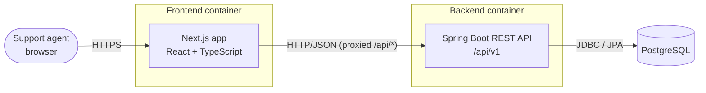
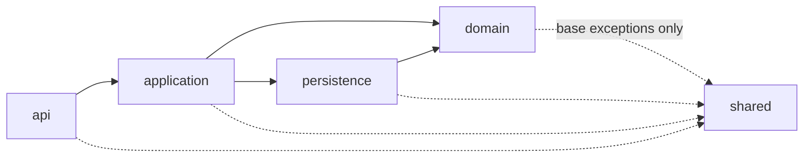
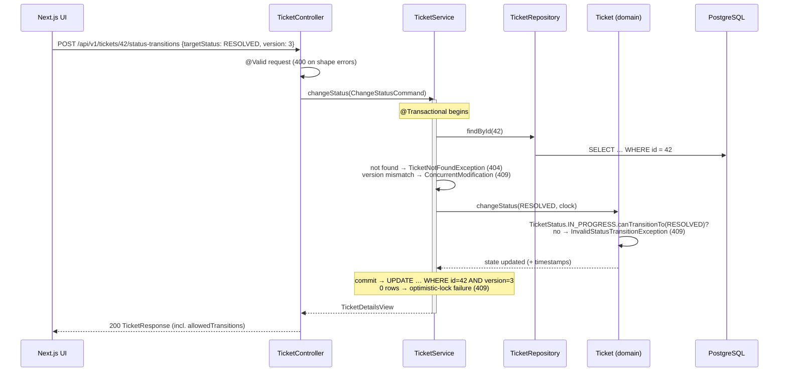
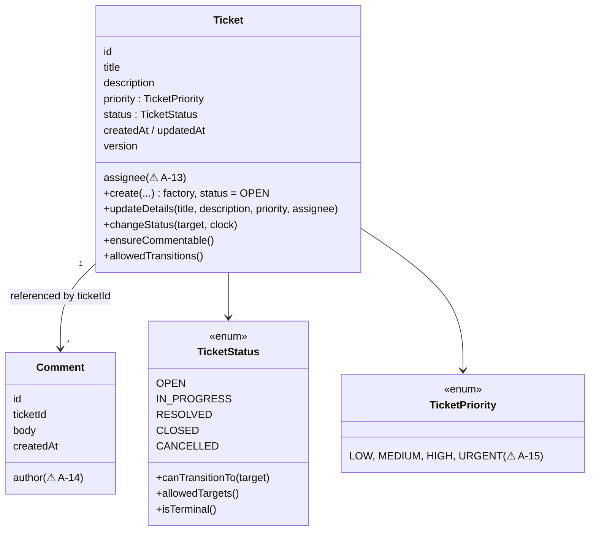
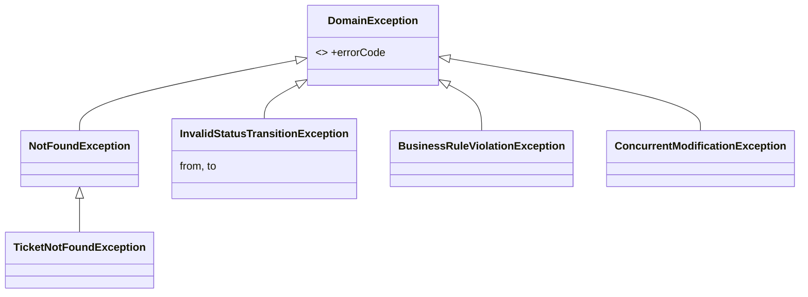

# Support Ticket Management System — Architecture

| Status | Last updated | Related |
|--------|--------------|---------|
| Draft — awaiting review | 2026-09-25 | [`requirements.md`](requirements.md), [`rules/java-springboot.md`](../rules/java-springboot.md), [`rules/api-standards.md`](../rules/api-standards.md), [`rules/testing.md`](../rules/testing.md), [`rules/security.md`](../rules/security.md) |

> **Phase note.** The SDD order puts the functional specification (`spec/functional-spec.md`) before architecture.
> It does not exist yet. This document therefore derives only from `requirements.md` and the project rules.
> Every point where behaviour isn't specified is marked **⚠ A-n** (assumption) and collected in §20.
> The functional spec must confirm or overturn each one, and this document is updated to match.

---

## 1. Goals and constraints

| Driver | Source | Architectural consequence |
|--------|--------|---------------------------|
| CRUD-style ticket workflow with comments, search and filter | REQ-1…7 | Single bounded context (`ticket`), request/response REST API |
| Durable persistence | REQ-8, TC-2 | PostgreSQL, schema owned by Flyway |
| Backend-enforced validation and state machine | REQ-9, REQ-11, REQ-12 | Rules live in the backend domain layer, never only in UI or controller |
| Meaningful UI errors | REQ-10 | Stable, machine-readable error contract (RFC 9457 + `code` + `errors[]`) |
| Java 21 / Spring Boot / Gradle / Next.js | TC-1…5 | See §3 |
| Maintainability over cleverness | Prompt | Modular monolith, package-by-feature, explicit layers, no speculative infrastructure |

**Quality attributes, in priority order:** correctness of business rules → maintainability/testability →
clear error reporting → data integrity under concurrency → performance, which is modest at this scale (⚠ A-1).

---

## 2. System context and containers



| Container | Technology | Responsibility |
|-----------|------------|----------------|
| Frontend | Next.js (App Router), React, TypeScript | UI, client-side UX validation, rendering server errors |
| Backend | Java 21, Spring Boot, Spring Web MVC, Spring Data JPA, Flyway | Business rules, validation, persistence, API contract |
| Database | PostgreSQL (⚠ A-2: version 16+) | System of record |

**Deployment shape (⚠ A-3):** two independently deployable processes plus a database. For local development,
`docker compose` runs PostgreSQL. Backend and frontend run from their own toolchains.
The browser only talks to the Next.js origin. Next.js forwards `/api/*` to the backend (rewrite/proxy),
so the browser never makes cross-origin calls and CORS stays tight. The backend still carries an explicit
CORS allow-list for direct access during development.

**Out of scope for v1 (⚠ A-4):** authentication, authorisation, multi-tenancy, attachments, notifications.
The architecture leaves extension points for them (§19).

---

## 3. Technology choices

| Concern | Choice | Notes |
|---------|--------|-------|
| Language | Java 21 (LTS) | Records, sealed types, pattern-matching switch |
| Framework | Spring Boot, latest GA at scaffolding time (⚠ A-5) | Spring Web MVC (servlet, blocking). WebFlux is unnecessary at this scale |
| Build | Gradle, Kotlin DSL, version catalog, wrapper committed | Separate `integrationTest` suite |
| Persistence | Spring Data JPA (Hibernate) + Flyway | `ddl-auto=validate`, OSIV off |
| Validation | Jakarta Bean Validation (Hibernate Validator) | Plus domain invariants |
| API docs | OpenAPI 3.1 file `spec/openapi.yaml` (canonical). springdoc optional for runtime UI | Contract-first |
| Frontend | Next.js App Router + TypeScript (⚠ A-6) | |
| Frontend data | TanStack Query (⚠ A-7) + typed fetch client generated from OpenAPI (`openapi-typescript`) | |
| Frontend forms | React Hook Form (⚠ A-7) | Server `errors[]` mapped onto fields |
| Tests | JUnit 5, AssertJ, Mockito, Spring Boot Test, Testcontainers, ArchUnit; Vitest + RTL + MSW; Playwright (optional) | See §15 |

---

## 4. Repository and module structure

```
support-ticket-management-system/
├── backend/                          # single Gradle project (⚠ A-8: not multi-module)
│   ├── build.gradle.kts
│   ├── settings.gradle.kts
│   ├── gradle/libs.versions.toml
│   └── src/
│       ├── main/java/com/supportdesk/…      (see §5)
│       ├── main/resources/
│       │   ├── application.yml, application-{profile}.yml
│       │   └── db/migration/V1__…sql
│       ├── test/java/…                      unit + web-slice tests
│       └── integrationTest/java/…           Testcontainers tests (*IT)
├── frontend/                         # Next.js app (see §6)
├── docker-compose.yml                # local PostgreSQL
├── spec/  docs/  rules/  skills/  commands/
```

A single Gradle project is enough for one bounded context. The layering is enforced in code by
**ArchUnit tests** (§15.1), not by Gradle module boundaries. If the system grows, features can be split into
Gradle modules or verified with Spring Modulith without changing the package design.

---

## 5. Backend architecture

### 5.1 Package structure

```
com.supportdesk
├── SupportDeskApplication
├── ticket/                         # the only feature (bounded context) in v1
│   ├── api/                        # HTTP adapter
│   │   ├── TicketController, TicketCommentController
│   │   ├── dto/                    # request/response records (API contract types)
│   │   └── TicketApiMapper         # DTO ↔ command/view mapping
│   ├── application/                # use cases
│   │   ├── TicketService           # create, update, change status, get, search
│   │   ├── TicketCommentService    # add / list comments
│   │   ├── command/                # CreateTicketCommand, UpdateTicketCommand, ChangeStatusCommand, AddCommentCommand
│   │   └── view/                   # TicketDetailsView, TicketSummaryView, CommentView (read models)
│   ├── domain/                     # business model and rules
│   │   ├── Ticket                  # aggregate root (JPA entity)
│   │   ├── Comment                 # entity (JPA)
│   │   ├── TicketStatus            # enum + transition table
│   │   ├── TicketPriority          # enum
│   │   ├── TicketSearchCriteria    # value object (keyword, statuses)
│   │   └── exception/              # TicketNotFoundException, InvalidStatusTransitionException, …
│   └── persistence/                # DB adapter
│       ├── TicketRepository        # Spring Data JPA
│       ├── CommentRepository
│       └── TicketSpecifications    # search + filter predicates
└── shared/
    ├── error/                      # GlobalExceptionHandler, ProblemDetail factory, ErrorCode catalogue, base exceptions
    ├── web/                        # CorrelationIdFilter, paging DTOs (PageResponse)
    └── config/                     # Clock bean, Jackson, CORS, @ConfigurationProperties records
```

### 5.2 Dependency direction



| Layer | May depend on | Must not depend on |
|-------|---------------|--------------------|
| `api` | `application` (commands, views, services), `domain` **enums only**, `shared` | `persistence`, entities |
| `application` | `domain`, `persistence`, `shared` | `api` |
| `domain` | JDK, Jakarta Persistence/Validation annotations, `shared.error` base exceptions | Spring Web, `api`, `application`, `persistence` |
| `persistence` | `domain`, Spring Data | `api`, `application` |

**Pragmatic trade-off (⚠ A-9, ADR candidate):** JPA entities live in `domain` and carry JPA annotations.
A fully separate persistence model (hexagonal, mapped both ways) would double the mapping code for little
gain here. The domain stays free of Spring **Web** and application concerns, and ArchUnit guards that.
Repositories are Spring Data interfaces in `persistence`, and the application layer depends on them
directly (no extra port interfaces) (⚠ A-10).

### 5.3 Responsibilities

| Component | Does | Does not |
|-----------|------|----------|
| **Controller** (`api`) | Maps HTTP to the use case. Binds and validates request DTOs (`@Valid`). Maps DTO → command, calls **one** service method, maps view → response DTO. Sets status code and `Location` header | Business rules, state-machine checks, repository access, transactions, building error bodies (the global handler does that) |
| **Application service** (`application`) | Defines the use case and owns the **transaction boundary**. Loads aggregates and throws `NotFound` when absent. Calls domain behaviour. Persists and maps to views inside the transaction. Logs business events | HTTP concerns, DTO types, re-implementing rules that belong to the domain |
| **Domain model** (`domain`) | Enforces **invariants and business rules**: legal status transitions, editable-field rules, timestamps. Exposes intention-revealing methods (`changeStatus`, `updateDetails`, `addComment` guard). Throws domain exceptions | Persistence calls, Spring beans, HTTP |
| **Repository** (`persistence`) | Loads and stores aggregates. Runs paged search/filter queries with bound parameters and escaped `LIKE` terms. Fetch-joins for detail reads | Business decisions, transactions (uses the caller's) |
| **Global exception handler** (`shared.error`) | Maps every exception to Problem Details with a stable `code`. Logs at the right level. Attaches `correlationId` | Business logic |

### 5.4 Request flow example — change status



---

## 6. Frontend architecture

### 6.1 Structure (⚠ A-6, A-7)

```
frontend/src/
├── app/                              # Next.js App Router routes
│   ├── layout.tsx, error.tsx, not-found.tsx
│   └── tickets/
│       ├── page.tsx                  # list + search + status filter (state in URL query: ?q=&status=&page=)
│       ├── new/page.tsx              # create form
│       └── [id]/page.tsx             # details, edit form, status actions, comments
├── features/tickets/
│   ├── api/                          # typed calls: listTickets, getTicket, createTicket, …
│   ├── hooks/                        # TanStack Query hooks (useTickets, useUpdateTicket, …)
│   └── components/                   # TicketTable, TicketForm, StatusBadge, StatusActions, CommentList, CommentForm
├── lib/api/
│   ├── client.ts                     # fetch wrapper: base URL, JSON, problem+json → ApiError
│   ├── schema.d.ts                   # generated from spec/openapi.yaml
│   └── errors.ts                     # ApiError type, code → user message map
└── components/ui/                    # generic UI primitives (Button, Field, Alert, Spinner, EmptyState)
```

### 6.2 Principles

- **Backend is authoritative.** The frontend holds no business rules it could get wrong. Client-side validation
  (required, max length) mirrors the contract for fast feedback only.
- **The status controls are driven by the server.** Each ticket response includes `allowedTransitions`, which the domain
  computes (⚠ A-11). The UI renders only those actions, so the frontend never keeps a second copy of the state machine.
  If a stale UI still sends an illegal transition, the backend rejects it with 409 and the UI shows the message.
- **URL is the source of truth for list state** (`q`, `status`, `page`), which makes it shareable and survives a refresh.
- **Rendering (⚠ A-12):** pages are client components that use TanStack Query against the proxied API. Server-side
  rendering or React Server Components are not needed for an internal tool, and this keeps error handling in one place.
- **Error display (REQ-10):**

| Error | UI treatment |
|-------|--------------|
| `400` with `errors[]` | Message shown under each matching form field, plus a form-level summary |
| `404` | "Ticket not found" page/state |
| `409` `TICKET_INVALID_TRANSITION` | Inline alert with `detail`. Ticket is refetched |
| `409` `TICKET_CONCURRENT_MODIFICATION` | "This ticket was changed by someone else", with a reload action. The user's input is kept |
| `422` | Inline alert with `detail` |
| `5xx` / network | Generic retryable alert with `correlationId` for support. Raw bodies are never shown |

---

## 7. Domain model responsibilities

Entity attributes and column limits are finalised in `spec/data-model.md`. The **responsibilities** are fixed here.



- **Ticket is the aggregate root.** Its state changes only through its methods. There are no public setters.
  A new ticket always starts in `OPEN`, and clients cannot choose the initial status.
- **Comments are separate entities linked by `ticket_id`.** They are not a JPA collection on `Ticket`
  (⚠ A-16). Comments are append-only and can grow without bound. Loading them into the aggregate on every update
  would be wasteful, and they don't take part in Ticket invariants. The single rule linking them (can a comment be
  added in this status?) is checked with `Ticket.ensureCommentable()` before the comment is saved.
- **Rules that need decisions (see §20):** whether details can be edited in terminal states (⚠ A-17), whether
  comments are allowed in terminal states (⚠ A-18), and whether an assignee is required before `IN_PROGRESS` (⚠ A-19).

---

## 8. State transition handling

### 8.1 Transition table (from REQ-11/12)

| From \ To | OPEN | IN_PROGRESS | RESOLVED | CLOSED | CANCELLED |
|-----------|:----:|:-----------:|:--------:|:------:|:---------:|
| **OPEN** | ✗ | ✅ | ✗ | ✗ | ✅ |
| **IN_PROGRESS** | ✗ | ✗ | ✅ | ✗ | ✅ |
| **RESOLVED** | ✗ | ✗ (⚠ A-20 reopen?) | ✗ | ✅ | ✗ |
| **CLOSED** (terminal) | ✗ | ✗ | ✗ | ✗ | ✗ |
| **CANCELLED** (terminal) | ✗ | ✗ | ✗ | ✗ | ✗ |

Self-transitions (e.g. `OPEN → OPEN`) are rejected (⚠ A-21), which keeps the rule "every accepted request is a
real change". The full matrix, diagram and error behaviour go in `spec/state-machine.md`.

### 8.2 Where the state-machine logic belongs

**In the domain layer, in two places:**

1. **`TicketStatus`** (enum) holds the **transition table**: an immutable map from each status to its allowed
   target statuses, with `canTransitionTo(target)`, `allowedTargets()` and `isTerminal()`. This is the **single
   source of truth**, declared in one screenful of code and unit-testable in isolation.
2. **`Ticket.changeStatus(target, clock)`** is the **only** way to change a ticket's status. It asks `TicketStatus`
   whether the move is legal and throws `InvalidStatusTransitionException(from, to)` if not. Otherwise it updates
   the status and any related data (e.g. `resolvedAt`/`closedAt` timestamps, ⚠ A-22). The status field has no setter.

The **application service** orchestrates the use case: load the ticket, check the version, call `changeStatus`,
commit. The **controller** translates HTTP. The **database** enforces that `status` holds one of the five values
(`CHECK` constraint). It does not encode transitions, because that would duplicate the rule in SQL.

### 8.3 Why not (only) in the controller

| Problem with controller-only logic | Consequence |
|------------------------------------|-------------|
| **It can be bypassed.** The rule applies only to that one HTTP endpoint. Any other path that changes status skips the check: another endpoint, a future bulk operation, a scheduled job such as auto-closing resolved tickets, a message consumer, an admin tool, or even `PATCH /tickets/{id}` if someone adds `status` to it | The invariant is not really enforced. `CLOSED → OPEN` becomes reachable |
| **Wrong state, wrong moment (time-of-check vs time-of-use).** A controller checks a status it read *outside* the transaction that writes the change. Two concurrent requests can both pass the check | Illegal sequences under concurrency. In the domain, the check runs on the entity loaded *inside* the transaction, protected by `@Version` optimistic locking |
| **Duplication.** Every entry point, plus the UI, would need its own copy of the table | Copies drift apart, and one of them ends up wrong |
| **Testability.** Controller logic can only be tested with a web slice (MockMvc) | A domain rule gets an exhaustive, millisecond-fast parameterised test over all 25 (from, to) pairs with no Spring context |
| **Layering and SRP.** Controllers are HTTP adapters (see `rules/java-springboot.md` §2.2) | Mixing business rules into adapters makes them fat, and the rules end up tied to one delivery mechanism |
| **Cohesion.** Status changes may carry side effects: timestamps, audit history, domain events | These belong next to the rule, in the aggregate, so they happen exactly when a legal transition happens |

Controllers may still *reject malformed input* early, for example an unknown enum value → 400. That is input
validation, not the state machine.

### 8.4 API shape (decided in the API-contract phase, ⚠ A-23)

Status changes use a **dedicated endpoint**, separate from the details update (REQ-4 lists only title, description,
priority and assignee). Recommended: `POST /api/v1/tickets/{id}/status-transitions` with `{ targetStatus, version }`,
returning the updated ticket. An illegal transition returns **409 Conflict** with code `TICKET_INVALID_TRANSITION`,
and `detail` names both states.

---

## 9. Database interaction

- **Spring Data JPA repositories** for aggregate load/save. Queries use derived methods, JPQL with bound parameters,
  or **JPA Specifications**. `TicketSpecifications` combines optional `keyword` and `status` predicates so that
  search and filter compose (REQ-6 + REQ-7 in one query).
- **Keyword search (⚠ A-24):** a case-insensitive substring match on `title` and `description`, written as
  `lower(col) LIKE lower(:pattern) ESCAPE '\'`. The user's `%`, `_` and `\` are escaped before wrapping in `%…%`.
  This runs the same on PostgreSQL and H2. Performance upgrade path: §12.
- **Reads for lists** use a projection (id, title, status, priority, assignee, updatedAt) and never load
  descriptions or comments. Lists are **always paginated** (default 20, max 100) with an allow-listed sort (default
  `createdAt,desc`, ⚠ A-25).
- **Detail reads** load the ticket by id, then comments with a separate query ordered by `createdAt`.
  That makes two queries, no N+1 and no cartesian join. Comments are paginated or capped (⚠ A-26).
- **Writes** go through aggregate methods followed by JPA dirty-checking at commit. There are no bulk `UPDATE`
  statements that bypass domain rules.
- **Optimistic locking:** `@Version` on `Ticket`. The client sends back the `version` it read (⚠ A-27: in the body,
  not `If-Match`). A mismatch returns 409.
- **Open-Session-in-View is disabled**, so lazy loading outside a transaction fails fast in tests instead of issuing
  hidden queries.

---

## 10. DTO strategy

Three families of types, one per boundary. Each is a Java `record`, immutable and free of framework logic:

| Type | Layer | Examples | Purpose |
|------|-------|----------|---------|
| **Request / response DTOs** | `api.dto` | `CreateTicketRequest`, `UpdateTicketRequest`, `AssignTicketRequest`, `ChangeStatusRequest`, `AddCommentRequest`, `TicketResponse`, `TicketSummaryResponse`, `CommentResponse`, `PageResponse<T>` | Mirror `spec/api-contract.md` exactly. Carry Bean Validation annotations. Jackson-serialised |
| **Commands** | `application.command` | `CreateTicketCommand`, `UpdateTicketCommand(id, version, …)`, `ChangeStatusCommand`, `AddCommentCommand` | Use-case input, independent of HTTP |
| **Views** | `application.view` | `TicketDetailsView`, `TicketSummaryView`, `CommentView` | Use-case output, built inside the transaction. Entities never cross this line |

- **Mapping is handwritten** in `TicketApiMapper` (API ↔ application) and in the services (entity → view) (⚠ A-28:
  no MapStruct). The mappings are small and explicit, and handwritten code stays debuggable.
- Views and response DTOs look alike, which is deliberate: the API contract can evolve (renames, versioning) without
  touching use cases, and the application layer never imports `api`.
- **PATCH semantics for REQ-4 (A-29, resolved):** assignee changes use their own endpoint
  (`PUT /tickets/{id}/assignee`, [`api-contract.md`](api-contract.md) §6.5), so every `PATCH` field is non-nullable and
  absent means unchanged. No tri-state JSON type is needed.
- Server-controlled fields (`id`, `status`, timestamps) do not exist on request DTOs. Unknown JSON properties → 400.

---

## 11. Validation strategy

Four layers of defence. Each rule is **owned** by exactly one layer, and the others back it up.

| # | Layer | What | Failure → |
|---|-------|------|-----------|
| 1 | Frontend (UX only) | Required fields, max lengths, enum pickers | Inline hint. Request not sent |
| 2 | **API — Bean Validation** on request DTOs | Shape: `@NotBlank`, `@Size(max)`, `@NotNull`, valid enum values, paging bounds, keyword length | **400** `VALIDATION_FAILED` + `errors[]` |
| 3 | **Domain** | Business rules: status transitions, edits/comments in terminal states, other invariants. Defensive invariant checks in `Ticket` factory/methods (e.g. title not blank) so the domain is valid even when called from outside the API | **409** / **422** with a specific `code` |
| 4 | **Database** | `NOT NULL`, lengths, `CHECK (status IN …)`, `CHECK (priority IN …)`, FKs | Should never trigger. If it does, it's a bug → 500 (logged) |

- Field limits (e.g. title max length) are **defined once** as constants shared by the DTO annotations and the domain,
  and match the column sizes in the Flyway migration. The values come from `spec/data-model.md`.
- **Normalisation (⚠ A-30):** title, description and comment body are trimmed of leading and trailing whitespace
  before validation. A whitespace-only value counts as blank.

---

## 12. PostgreSQL usage

- **Production and integration-test database.** Same major version in both (Testcontainers image pinned, ⚠ A-2).
- **Schema via Flyway** (`V1__create_ticket_tables.sql`, …). Migrations are immutable once merged, and
  `ddl-auto=validate` everywhere.
- **Conventions:**
  - `snake_case` names.
  - `bigint GENERATED ALWAYS AS IDENTITY` primary keys (⚠ A-31: numeric ids, shown to users as e.g. "#42").
    UUIDs would suit a public or multi-tenant system.
  - `timestamptz` for all timestamps, stored in UTC.
  - `varchar(n)` for **all** text columns. `text` is avoided because of H2 portability and Hibernate `validate`
    type matching (see [`data-model.md`](data-model.md) §14).
  - Enums stored as `varchar` + `CHECK`.
  - FK `ticket_comment.ticket_id → ticket.id` with `ON DELETE RESTRICT` (tickets are never hard-deleted in v1).
- **Indexes:** `ticket(status, created_at DESC, id DESC)`, `ticket(created_at DESC, id DESC)`, `ticket_comment(ticket_id, created_at, id)`. Search starts with a plain
  `LIKE` scan, which is fine at the expected volume (⚠ A-1). **Upgrade path**, driven by measurement: the `pg_trgm`
  extension with GIN indexes on `lower(title)`/`lower(description)`, then `tsvector` full-text search. Both are
  PostgreSQL-only and would be marked as such in the migration.
- **Connection pool:** HikariCP (Spring Boot default). Pool size is set through configuration.
- Credentials come only from environment variables (`rules/security.md`).

## 13. H2 usage

H2 is a **convenience, not a target platform**.

| Use | Allowed? | Why |
|-----|----------|-----|
| `h2` Spring profile for zero-dependency local runs (no Docker), in PostgreSQL compatibility mode, in-memory | ✅ (⚠ A-32) | Quick demo or frontend development without Docker |
| Unit tests (domain, services with Mockito) | n/a | They don't need a database |
| `@WebMvcTest` | n/a | Web slice, database not loaded |
| Repository / search / migration / integration tests | ❌ | Dialect differences (case handling, `LIKE`/escape, `timestamptz`, identity, `CHECK` behaviour) would hide real bugs. Testcontainers PostgreSQL is used instead |

**Consequence:** the Flyway migrations **must run on both** PostgreSQL and H2 in PostgreSQL mode. Anything
PostgreSQL-specific (e.g. `pg_trgm`) goes in a vendor-specific migration location
(`db/migration/{vendor}`) or the H2 profile is dropped. The **primary local setup is `docker compose` PostgreSQL**,
and H2 is the fallback.

---

## 14. Exception handling and API error format

### 14.1 Exception model



- All unchecked. Each carries a stable `ErrorCode` (enum in `shared.error`) that maps to an HTTP status and a
  problem `type` URI.
- **One `@RestControllerAdvice`** (`GlobalExceptionHandler`, built on Spring's `ResponseEntityExceptionHandler`)
  turns exceptions into `ProblemDetail`. Controllers and services never build error responses themselves.

### 14.2 Mapping

| Source | Status | `code` |
|--------|--------|--------|
| Bean Validation on body (`MethodArgumentNotValidException`) / params (`HandlerMethodValidationException`, `ConstraintViolationException`) | 400 | `VALIDATION_FAILED` + `errors[]` |
| Malformed JSON / unknown property / bad enum (`HttpMessageNotReadableException`) | 400 | `MALFORMED_REQUEST` |
| Path/query type mismatch or constraint violation | 400 | `VALIDATION_FAILED` (`location: path/query`) |
| `TicketNotFoundException` | 404 | `TICKET_NOT_FOUND` |
| Unknown route | 404 | `RESOURCE_NOT_FOUND` |
| Unsupported method / media type | 405 / 415 | `METHOD_NOT_ALLOWED` / `UNSUPPORTED_MEDIA_TYPE` |
| `InvalidStatusTransitionException` | 409 | `TICKET_INVALID_TRANSITION` |
| Version mismatch / `ObjectOptimisticLockingFailureException` | 409 | `TICKET_CONCURRENT_MODIFICATION` |
| `BusinessRuleViolationException`: edit/assign or comment in terminal state (⚠ A-17, A-18) | 422 | `TICKET_NOT_EDITABLE` / `TICKET_NOT_COMMENTABLE` |
| Anything else | 500 | `INTERNAL_ERROR`, generic `detail` |

The authoritative catalogue lives in [`api-contract.md`](api-contract.md) §2. The frontend switches on `code` only.

### 14.3 Response format

RFC 9457 `application/problem+json`, as specified in [`rules/api-standards.md` §5](../rules/api-standards.md):
`type`, `title`, `status`, `detail`, `instance`, plus the extensions `code`, `correlationId`, `timestamp`, and
`errors[]` (`location`, `field`, `code`, `message`; submitted values are never echoed), plus per-code business
extensions ([`api-contract.md`](api-contract.md) §2).
`detail` is always safe to show to end users. Stack traces, SQL and class names never appear.

### 14.4 Logging of errors

4xx responses are logged at `INFO`/`WARN` without stack traces. 5xx responses are logged at `ERROR` with the stack
trace and `correlationId`.

---

## 15. Testing architecture

Detailed cases go in `spec/test-strategy.md`. The structure is fixed here, per [`rules/testing.md`](../rules/testing.md).

### 15.1 Backend test layers

| Layer | Source set / task | Spring context | DB | Focus |
|-------|-------------------|----------------|----|-------|
| Domain unit | `test` / `./gradlew test` | none | none | **Exhaustive 5×5 transition matrix**, `Ticket` invariants, search-term escaping |
| Service unit | `test` | none (Mockito) | mocked repositories | Orchestration: not-found, version checks, delegation to domain |
| Web slice | `test` | `@WebMvcTest` | none | JSON binding, Bean Validation → 400 bodies, every error `code`, status codes, `Location` headers |
| Architecture | `test` | none | none | **ArchUnit**: layer dependencies (§5.2), no entities in `api`, no `@Transactional` in controllers, no field injection |
| Persistence | `integrationTest` / `./gradlew integrationTest` | `@DataJpaTest` | **Testcontainers PostgreSQL** | Flyway applies, constraints, search + filter + paging, escaping, optimistic locking |
| End-to-end API | `integrationTest` | `@SpringBootTest(RANDOM_PORT)` | Testcontainers PostgreSQL | Full flows per requirement, including illegal transitions and concurrent-update 409 |

- Testcontainers is wired with Spring Boot's `@ServiceConnection` and one **shared container per test JVM**
  for speed.
- A fixed `Clock` bean in tests makes timestamps deterministic.
- JaCoCo aggregates `test` and `integrationTest` execution data. The thresholds from `rules/testing.md` apply
  to `domain` and `application`.

### 15.2 Frontend test layers

| Layer | Tool | Focus |
|-------|------|-------|
| Component | Vitest + React Testing Library | Forms, field-level server errors, status actions rendered from `allowedTransitions`, empty/loading states |
| API-integration (mocked) | MSW with contract-shaped payloads | Every error `code` → correct UI message. List query params ↔ URL |
| E2E (optional) | Playwright against backend + PostgreSQL | Create → progress → resolve → close. One illegal-transition path |

### 15.3 Contract alignment

`spec/openapi.yaml` is the shared contract. Frontend types are generated from it. A backend integration test
compares springdoc's generated spec against the checked-in file, or validates responses against it (⚠ A-33),
so the implementation cannot silently drift from the contract.

---

## 16. Transaction boundaries

| Use case | Service method | Transaction |
|----------|----------------|-------------|
| Create ticket | `TicketService.create` | read-write |
| Update details | `TicketService.updateDetails` | read-write, optimistic lock |
| Change status | `TicketService.changeStatus` | read-write, optimistic lock |
| Add comment | `TicketCommentService.addComment` | read-write. Loads the ticket to check the status rule (⚠ A-18) |
| Get details | `TicketService.getDetails` | `readOnly = true` |
| List / search / filter | `TicketService.search` | `readOnly = true` |

- `@Transactional` sits **only** on public application-service methods, with one use case per transaction.
- Entity → view mapping happens **inside** the transaction.
- There is no I/O other than the database inside transactions. Future notifications go through
  after-commit events (§19).
- **Adding a comment and optimistic locking (⚠ A-34):** adding a comment does **not** bump the ticket's `version`,
  so comments never cause edit conflicts. If a comment and a status change race, the comment follows the status
  rule as read in its own transaction. That is acceptable for v1, and stricter serialisation would use a
  pessimistic lock on the ticket row.

---

## 17. Configuration management

- **`application.yml`** holds shared defaults. Profile files are:
  - `local`: docker-compose PostgreSQL, verbose SQL logging off by default.
  - `h2`: in-memory fallback, §13.
  - `test`: shared test settings. Testcontainers supplies the datasource.
  - `prod`: JSON logs, no defaults for secrets.
- **Environment variables** supply all environment-specific values and every secret, e.g. `SPRING_DATASOURCE_URL`,
  `SPRING_DATASOURCE_USERNAME`, `SPRING_DATASOURCE_PASSWORD`, and `SUPPORTDESK_CORS_ALLOWED_ORIGINS`.
  `.env.example` documents them. `.env` is git-ignored.
- **Typed application settings** use `@ConfigurationProperties(prefix = "supportdesk")` records with
  `@Validated`, so the app **fails fast at startup** on invalid config. Examples: paging default/max size, CORS
  origins, max keyword length.
- Fixed settings in every profile: `spring.jpa.open-in-view=false`, `spring.jpa.hibernate.ddl-auto=validate`,
  `spring.mvc.problemdetails.enabled=true`, Jackson set to fail on unknown properties, and Actuator exposing
  only `health` and `info`.
- **Frontend:** `BACKEND_URL` is server-side only and used by the Next.js proxy. No secrets live in `NEXT_PUBLIC_*`
  variables.

## 18. Logging

- SLF4J + Logback (Spring Boot default).
- **Correlation id:** a `CorrelationIdFilter` reads `X-Correlation-Id`, or generates one if missing. It puts the id
  in the MDC, echoes it in the response header, and adds it to every Problem Details body. The frontend shows it on
  5xx errors.
- **Format:** readable console output in `local`/`h2`. In `prod`, **structured JSON** using Spring Boot's
  built-in structured logging, if available in the chosen version (⚠ A-5). Otherwise a Logback JSON encoder.
- **What is logged:**
  - `INFO`: business events such as "ticket created", "status changed OPEN→IN_PROGRESS", with ticket id and
    correlation id.
  - `WARN`: rejected transitions and conflicts.
  - `ERROR`: unexpected exceptions.
  - `DEBUG`: SQL, local only.
- **Never logged:** secrets, full request bodies, ticket descriptions or comment text (they may contain customer PII).

---

## 19. Future extensibility

| Likely change | Extension point prepared now |
|---------------|------------------------------|
| **Authentication / authorisation** | Spring Security added as a filter chain, with OIDC/JWT as a resource server. Controllers stay unchanged. `assignee` and comment `author` move from free text to user references (⚠ A-13/14). Security checks go in application services |
| **Audit trail / status history** | `Ticket.changeStatus` is the single choke point, so recording a `ticket_status_history` row or a domain event there covers every path |
| **Notifications / integrations** | Spring `ApplicationEventPublisher` with `@TransactionalEventListener(AFTER_COMMIT)`. Upgrade to an outbox table if delivery must be guaranteed |
| **Richer search** | `TicketSearchCriteria` + `TicketSpecifications` isolate the query. Swap in `pg_trgm`/full-text search, or an external engine, behind the same service method |
| **More workflow rules** (reopen, SLA timers, required assignee) | Transition table in `TicketStatus`. Guard conditions in `Ticket.changeStatus`. Everything has exhaustive unit tests |
| **New features** (tags, attachments, teams) | New top-level feature packages following the same four-layer layout, with ArchUnit rules applied to them automatically |
| **API evolution** | `/api/v1` prefix. DTOs are decoupled from views, so v2 DTOs can map onto the same use cases |
| **Scaling** | Stateless backend, which scales horizontally. Optimistic locking already handles concurrent writers |
| **Module split** | Packages are already feature-isolated. They can become Gradle modules or Spring Modulith modules |

---

## 20. Assumptions and decisions requiring confirmation

Each item is an architectural decision made **without an explicit requirement**. Items marked **Spec** must be
answered in `spec/functional-spec.md`. Items marked **ADR** will be recorded in `docs/adr/` once approved.

| ID | Assumption / decision | Recommended default | Resolve in |
|----|-----------------------|---------------------|-----------|
| A-1 | Scale: internal tool, ≤ 100k tickets, tens of concurrent users | Simple `LIKE` search, no cache | Spec (NFR) |
| A-2 | PostgreSQL major version | 16+ (same in tests via Testcontainers). PostgreSQL itself confirmed in [ADR-0001](../docs/adr/0001-use-postgresql.md) | ADR |
| A-3 | Deployment: separate backend + Next.js processes, Next.js proxies `/api/*` | Yes | ADR |
| A-4 | No authentication/authorisation in v1 | Out of scope, extension point only | Spec |
| A-5 | Spring Boot version | Latest GA at scaffolding. Verify API names used in the rules (`@MockitoBean`, structured logging, Jackson config) against it | ADR |
| A-6 | Next.js App Router + TypeScript | Yes | ADR |
| A-7 | TanStack Query + React Hook Form + openapi-typescript | Yes | ADR |
| A-8 | Single Gradle project, not multi-module | Yes, with layers enforced by ArchUnit | ADR |
| A-9 | JPA entities are the domain model (no separate persistence model) | Yes | ADR |
| A-10 | Application services use Spring Data repositories directly (no port interfaces) | Yes | ADR |
| A-11 | Ticket responses include server-computed `allowedTransitions` | Yes | API contract |
| A-12 | Frontend pages are client-rendered (no SSR/RSC data fetching) | Yes | ADR |
| A-13 | `assignee` is free text (name/email) in v1, not a user entity | Free text, optional, max length TBD | **Spec** |
| A-14 | Comment `author` is free text supplied by the client (no auth) | Free text, required | **Spec** |
| A-15 | Priority values | `LOW, MEDIUM, HIGH, URGENT`, default `MEDIUM` | **Spec** |
| A-16 | Comments are a separate entity, not a JPA collection on `Ticket` | Yes | ADR |
| A-17 | Title/description/priority/assignee **cannot** be edited in `CLOSED` or `CANCELLED` (422 `TICKET_NOT_EDITABLE`). Editable in `RESOLVED` | Yes | **Spec** |
| A-18 | Comments **cannot** be added to `CLOSED`/`CANCELLED` tickets. Allowed in `RESOLVED` | Yes | **Spec** |
| A-19 | No assignee required to move to `IN_PROGRESS` | Not required | **Spec** |
| A-20 | `RESOLVED → IN_PROGRESS` (reopen) is **not** allowed, per REQ-11 as written | Not allowed | **Spec** |
| A-21 | Self-transitions rejected with 409 | Rejected | **Spec** |
| A-22 | Record `resolvedAt` / `closedAt` / `cancelledAt` timestamps | Yes (cheap, useful) | Spec / data model |
| A-23 | Status change via `POST /tickets/{id}/status-transitions` | Yes | API contract (ADR) |
| A-24 | Keyword search: case-insensitive substring on title + description (not comments) | Yes | **Spec** |
| A-25 | Default sort `createdAt desc`. Allowed sorts: `createdAt`, `updatedAt`, `priority`, `status` | Yes | Spec / API contract |
| A-26 | Comments returned with ticket details (up to a cap) or via their own paginated endpoint | Separate `GET /tickets/{id}/comments`, paginated | API contract |
| A-27 | Optimistic-lock version sent in request body, not `If-Match` | Body | API contract |
| A-28 | Handwritten mappers (no MapStruct) | Yes | ADR |
| A-29 | ~~PATCH tri-state for clearing the assignee~~ **Resolved:** separate `PUT /tickets/{id}/assignee` | — | Done (api-contract §6.5) |
| A-30 | Text inputs trimmed. Whitespace-only = blank | Yes | **Spec** |
| A-31 | Numeric identity ids exposed as ticket numbers | Yes | Data model (ADR) |
| A-32 | Keep an `h2` profile at all (vs. PostgreSQL-only local setup) | Keep as fallback | ADR |
| A-33 | Contract drift detection between code and `openapi.yaml` | Yes, in the integration tests | Test strategy |
| A-34 | Comments don't bump ticket `version`. Comment vs status race accepted in v1 | Yes | Spec (NFR) |

## 21. Open questions for the product owner

The items marked **Spec** above: A-4, A-13, A-14, A-15, A-17, A-18, A-19, A-20, A-21, A-24, A-30.
The most consequential are **A-17/A-18** (what "terminal" allows) and **A-20** (reopen).

## Changelog

- 2026-09-25 — Initial draft.
- 2026-09-25 — §12 aligned with `data-model.md`: `varchar(n)` only, table `ticket_comment`, composite indexes. A-13/14/15/22/31 given concrete values there.
- 2026-09-25 — Aligned with `api-contract.md`: assignee endpoint (A-29), `VALIDATION_FAILED` for path/query errors, error-body fields, `TICKET_NOT_COMMENTABLE`.
- 2026-09-25 — PostgreSQL confirmed over MySQL/MongoDB ([ADR-0001](../docs/adr/0001-use-postgresql.md)).
