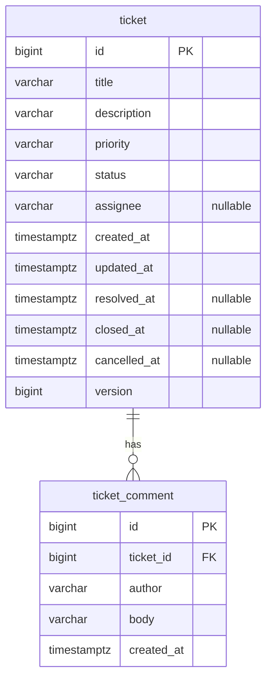

# Support Ticket Management System — Data Model

| Status | Last updated | Related |
|--------|--------------|---------|
| Draft — awaiting review | 2026-09-25 | [`requirements.md`](requirements.md), [`architecture.md`](architecture.md) §7, §9, §12, §13, [`rules/java-springboot.md`](../rules/java-springboot.md) §5 |

This document defines the **persistence model**: tables, columns, constraints, indexes and migrations.
It is the single source of truth for **field limits**. The API contract (`spec/api-contract.md`) and the Bean
Validation constants reference these values instead of redefining them.

> Decisions that depend on unanswered product questions are marked **⚠ A-n** (from `architecture.md` §20)
> or **⚠ DM-n** (new here, see §16). The functional spec may still change them.

---

## 1. Entities

| Entity | Table | Role | Mutability |
|--------|-------|------|------------|
| **Ticket** | `ticket` | Aggregate root. A support request with lifecycle status | Mutable (details + status), optimistic-locked |
| **Comment** | `ticket_comment` | A note appended to a ticket | **Append-only** — no edit, no delete in v1 (⚠ DM-1) |

The table is named `ticket_comment` rather than `comment` because `COMMENT` is a reserved/keyword-like word in both
PostgreSQL (`COMMENT ON …`) and H2. Avoiding it prevents quoting issues. The Java entity stays `Comment`.

No other tables in v1: assignees and authors are free text (⚠ A-13, A-14), and there is no user table
(no authentication, ⚠ A-4).

---

## 2. Relationships



| Relationship | Cardinality | Owning side | Delete behaviour |
|--------------|-------------|-------------|------------------|
| Ticket → Comment | 1 : 0..N | `ticket_comment.ticket_id` | `ON DELETE RESTRICT`. Tickets are never hard-deleted in v1 (⚠ DM-2) |

**ORM mapping (for the Backend phase, not code):** `Comment` holds the ticket reference as a plain `ticketId`
column or a `@ManyToOne(fetch = LAZY)`. `Ticket` has **no** `@OneToMany comments` collection (architecture §7, A-16).
Comments are always read with an explicit, ordered, paginated query.

---

## 3. Table: `ticket`

| Column | PostgreSQL type | Null? | Default | Constraints | Java field / API property |
|--------|-----------------|-------|---------|-------------|---------------------------|
| `id` | `bigint` | NOT NULL | `GENERATED ALWAYS AS IDENTITY` | **PK** `pk_ticket` | `id` |
| `title` | `varchar(200)` | NOT NULL | — | `ck_ticket_title_not_blank` | `title` |
| `description` | `varchar(5000)` | NOT NULL (⚠ DM-3) | — | `ck_ticket_description_not_blank` | `description` |
| `priority` | `varchar(20)` | NOT NULL | — (application sets `MEDIUM` when omitted, ⚠ A-15) | `ck_ticket_priority` | `priority` |
| `status` | `varchar(20)` | NOT NULL | — (application always sets `OPEN` on create) | `ck_ticket_status` | `status` |
| `assignee` | `varchar(100)` | **NULL** | — | `ck_ticket_assignee_not_blank` (if present) | `assignee` |
| `created_at` | `timestamptz` | NOT NULL | — (set by application) | — | `createdAt` |
| `updated_at` | `timestamptz` | NOT NULL | — (set by application) | `ck_ticket_updated_after_created` | `updatedAt` |
| `resolved_at` | `timestamptz` | NULL | — | `ck_ticket_status_timestamps` | `resolvedAt` (⚠ A-22) |
| `closed_at` | `timestamptz` | NULL | — | `ck_ticket_status_timestamps` | `closedAt` (⚠ A-22) |
| `cancelled_at` | `timestamptz` | NULL | — | `ck_ticket_status_timestamps` | `cancelledAt` (⚠ A-22) |
| `version` | `bigint` | NOT NULL | `0` | `ck_ticket_version_non_negative` | `version` (JPA `@Version`) |

## 4. Table: `ticket_comment`

| Column | PostgreSQL type | Null? | Default | Constraints | Java field / API property |
|--------|-----------------|-------|---------|-------------|---------------------------|
| `id` | `bigint` | NOT NULL | `GENERATED ALWAYS AS IDENTITY` | **PK** `pk_ticket_comment` | `id` |
| `ticket_id` | `bigint` | NOT NULL | — | **FK** `fk_ticket_comment_ticket` → `ticket(id)` `ON DELETE RESTRICT` | `ticketId` |
| `author` | `varchar(100)` | NOT NULL (⚠ A-14) | — | `ck_ticket_comment_author_not_blank` | `author` |
| `body` | `varchar(5000)` | NOT NULL | — | `ck_ticket_comment_body_not_blank` | `body` (the comment text) |
| `created_at` | `timestamptz` | NOT NULL | — (set by application) | — | `createdAt` |

Comments have no `updated_at` and no `version`, because they are immutable (⚠ DM-1). If editing is added later,
both columns get added in a new migration.

---

## 5. Primary keys

- **Surrogate `bigint` identity keys** on both tables: `GENERATED ALWAYS AS IDENTITY` (⚠ A-31).
  - `ALWAYS` rather than `BY DEFAULT` stops test fixtures or ad-hoc SQL from inserting explicit ids that
    collide with the sequence later.
  - The JPA mapping uses `GenerationType.IDENTITY`. The trade-off is that Hibernate cannot batch inserts, which is
    irrelevant at this write volume.
- Ticket ids are shown to users as ticket numbers (e.g. `#42`). They are not secret, because there is no auth and
    no multi-tenancy (A-4). If either is introduced, add a public `uuid` column and stop exposing sequential ids.
- Natural keys: none. Titles are not unique.

## 6. Foreign keys

| Name | Column | References | On delete | On update | Index |
|------|--------|------------|-----------|-----------|-------|
| `fk_ticket_comment_ticket` | `ticket_comment.ticket_id` | `ticket.id` | `RESTRICT` | `NO ACTION` (ids are immutable) | `ix_ticket_comment_ticket_created` (§9). PostgreSQL does **not** index FK columns automatically |

## 7. Required vs nullable fields

| Field | Required on create? | Nullable in DB? | Editable after create? | Rule |
|-------|---------------------|-----------------|------------------------|------|
| `ticket.title` | ✅ | ❌ | ✅ (REQ-4) unless terminal (⚠ A-17) | 1–200 chars after trim |
| `ticket.description` | ✅ (⚠ DM-3) | ❌ | ✅ (REQ-4) unless terminal | 1–5000 chars after trim |
| `ticket.priority` | Optional in the request, defaults to `MEDIUM` (⚠ A-15) | ❌ | ✅ (REQ-4) unless terminal | Enum §8 |
| `ticket.assignee` | Optional | ✅ | ✅ (REQ-4), including clearing it via `PUT /tickets/{id}/assignee` (api-contract §6.5) unless terminal | 1–100 chars after trim when present. Blank input is stored as `NULL` (⚠ DM-4) |
| `ticket.status` | ❌ server-set to `OPEN` | ❌ | Only via status transition (architecture §8) | Enum §8 |
| `ticket.created_at` / `updated_at` | server-set | ❌ | server-managed | §11 |
| `ticket.resolved_at` / `closed_at` / `cancelled_at` | server-set | ✅ | server-managed on transition | §11 |
| `ticket.version` | server-set | ❌ | incremented by JPA | — |
| `ticket_comment.author` | ✅ (⚠ A-14) | ❌ | never | 1–100 chars after trim |
| `ticket_comment.body` | ✅ | ❌ | never | 1–5000 chars after trim |
| `ticket_comment.created_at` | server-set | ❌ | never | §11 |

**Length semantics:** limits count **characters** (Unicode code points), matching PostgreSQL `varchar(n)` and
`char_length`. Bean Validation's `@Size` counts UTF-16 code units, so a supplementary character (e.g. emoji) counts
as 2. The DTO limit is therefore never looser than the DB limit. This is safe, but a value exactly at the limit that
contains emoji could be rejected by the API even though the DB would accept it (⚠ DM-5, acceptable).

All text is **trimmed** by the application before validation and storage (⚠ A-30). The DB `CHECK`s reject blank
values as a backstop.

---

## 8. Enum values

Stored as `varchar(20)` holding the Java enum constant name (`@Enumerated(EnumType.STRING)`), guarded by a `CHECK`.
Never ordinal.

### 8.1 `ticket.status` — `TicketStatus`

| Value | Meaning | Terminal? |
|-------|---------|-----------|
| `OPEN` | Created, not yet being worked on (initial state) | No |
| `IN_PROGRESS` | Being worked on | No |
| `RESOLVED` | Fix provided, awaiting closure | No |
| `CLOSED` | Done | **Yes** |
| `CANCELLED` | Abandoned | **Yes** |

Transitions are **not** encoded in the database. They are enforced in the domain (`architecture.md` §8).
The database only guarantees that the value is one of the five, and that the lifecycle timestamps agree with the
status (§10.3).

### 8.2 `ticket.priority` — `TicketPriority` (⚠ A-15)

| Value | Rank (for sorting) |
|-------|--------------------|
| `LOW` | 1 |
| `MEDIUM` (default) | 2 |
| `HIGH` | 3 |
| `URGENT` | 4 |

Adding an enum value requires a migration that replaces the `CHECK` constraint (§12.4).

---

## 9. Indexes

| Name | Table | Columns | Purpose |
|------|-------|---------|---------|
| `pk_ticket` | `ticket` | `id` | PK (implicit) |
| `ix_ticket_created_at` | `ticket` | `created_at DESC, id DESC` | Default list order (`createdAt desc`, ⚠ A-25) with a stable tie-breaker for pagination |
| `ix_ticket_status_created_at` | `ticket` | `status, created_at DESC, id DESC` | REQ-7 status filter combined with the default order |
| `pk_ticket_comment` | `ticket_comment` | `id` | PK (implicit) |
| `ix_ticket_comment_ticket_created` | `ticket_comment` | `ticket_id, created_at, id` | FK index + ordered, paginated comment retrieval per ticket |

**Deliberately not indexed in v1:**
- `assignee`: no requirement to filter by it.
- `updated_at`, `priority`: allowed sort keys (⚠ A-25), but a sort over a filtered, paginated result is cheap at the
  expected volume (⚠ A-1). Add indexes when measurements justify them.
- Keyword search: a substring search (`%term%`) cannot use a B-tree index (§10).

Every list query ends its `ORDER BY` with `id` so pagination is deterministic when timestamps tie.

---

## 10. Database constraints

### 10.1 Summary

| Name | Table | Definition (logical) |
|------|-------|----------------------|
| `pk_ticket` | ticket | `PRIMARY KEY (id)` |
| `ck_ticket_title_not_blank` | ticket | `TRIM(title) <> ''` |
| `ck_ticket_description_not_blank` | ticket | `TRIM(description) <> ''` |
| `ck_ticket_assignee_not_blank` | ticket | `assignee IS NULL OR TRIM(assignee) <> ''` |
| `ck_ticket_priority` | ticket | `priority IN ('LOW','MEDIUM','HIGH','URGENT')` |
| `ck_ticket_status` | ticket | `status IN ('OPEN','IN_PROGRESS','RESOLVED','CLOSED','CANCELLED')` |
| `ck_ticket_updated_after_created` | ticket | `updated_at >= created_at` |
| `ck_ticket_version_non_negative` | ticket | `version >= 0` |
| `ck_ticket_status_timestamps` | ticket | see §10.3 |
| `pk_ticket_comment` | ticket_comment | `PRIMARY KEY (id)` |
| `fk_ticket_comment_ticket` | ticket_comment | `FOREIGN KEY (ticket_id) REFERENCES ticket(id) ON DELETE RESTRICT` |
| `ck_ticket_comment_author_not_blank` | ticket_comment | `TRIM(author) <> ''` |
| `ck_ticket_comment_body_not_blank` | ticket_comment | `TRIM(body) <> ''` |

Plus `NOT NULL` and `varchar(n)` length limits per §3–4.

### 10.2 Principles

- **Every constraint is explicitly named** (`pk_`, `fk_`, `ck_`, `ix_`, `uq_` prefixes). Names appear in logs and
  migration diffs, and stay identical on PostgreSQL and H2.
- DB constraints are the **last line of defence**. The API and domain layers reject invalid data first, with a
  proper 400/409/422. A DB constraint violation reaching the handler means a bug, and it surfaces as `500`
  (`INTERNAL_ERROR`, logged with the constraint name). The code does not map constraint names to user messages.
- Constraints are written in standard SQL that runs unchanged on both databases (§13).

### 10.3 Lifecycle-timestamp consistency — `ck_ticket_status_timestamps`

Given REQ-11 as written (no reopen, ⚠ A-20), each status implies exactly which lifecycle timestamps are set:

| status | `resolved_at` | `closed_at` | `cancelled_at` |
|--------|---------------|-------------|----------------|
| `OPEN` | NULL | NULL | NULL |
| `IN_PROGRESS` | NULL | NULL | NULL |
| `RESOLVED` | NOT NULL | NULL | NULL |
| `CLOSED` | NOT NULL | NOT NULL | NULL |
| `CANCELLED` | NULL | NULL | NOT NULL |

Expressed as one `CHECK` with an `OR` per status row. This catches any code path that changes status without going
through `Ticket.changeStatus`. **If reopen (A-20) is ever allowed, this constraint must be revisited in the same
migration**, because a reopened ticket would have to clear or keep `resolved_at`.

---

## 11. Audit timestamps

| Column | Set when | Set by |
|--------|----------|--------|
| `ticket.created_at` | Insert | Domain/application, from the injected `Clock` |
| `ticket.updated_at` | Insert (= `created_at`), every detail update, every status transition | Domain methods (`updateDetails`, `changeStatus`), from `Clock` |
| `ticket.resolved_at` | Transition to `RESOLVED` | `Ticket.changeStatus` |
| `ticket.closed_at` | Transition to `CLOSED` | `Ticket.changeStatus` |
| `ticket.cancelled_at` | Transition to `CANCELLED` | `Ticket.changeStatus` |
| `ticket_comment.created_at` | Insert | Application, from `Clock` |

Rules:
- **Application-managed, not DB defaults / triggers.** An injected `Clock` makes timestamps deterministic in tests
  and keeps the logic in one visible place. No `DEFAULT now()` either: a missing timestamp should fail loudly on
  `NOT NULL` instead of being silently filled in. Hibernate's `@CreationTimestamp`/`@UpdateTimestamp` are **not**
  used, because they bypass the injected `Clock`.
- **Adding a comment does not change `ticket.updated_at` or `version`** (⚠ A-34, DM-6). `updatedAt` means "the ticket
  record changed", not "last activity". A `last_activity_at` column can be added if the UI needs that sort.
- **Type & precision:** `timestamptz` stores an absolute instant (UTC internally) with **microsecond** precision.
  Java `Instant` carries nanoseconds, so the `Clock` bean is wrapped to truncate to microseconds
  (`Clock.tick(…, 1µs)`). Otherwise a value read back would differ from the value written, and equality
  assertions in tests would be flaky.
- The JVM and the JDBC session run in **UTC** (`hibernate.jdbc.time_zone=UTC`), so the server's time zone never
  affects stored values. The API emits ISO-8601 `Z` strings.
- **Who** changed something (`created_by`/`updated_by`) is not recorded in v1, because there are no users (A-4).
  A full change history (status history table) is a future extension (architecture §19).

---

## 12. Migration strategy

### 12.1 Tooling

- **Flyway**, run by Spring Boot on startup (`spring.flyway.enabled=true`), with Hibernate `ddl-auto=validate`.
  Hibernate never changes the schema.
- Flyway 10+ needs the separate **`flyway-database-postgresql`** module on the classpath. H2 support is built in.
  Both come from the version catalog.
- `spring.flyway.clean-disabled=true` in every non-test profile.

### 12.2 Layout and naming

```
backend/src/main/resources/db/
├── migration/
│   ├── common/                 # portable SQL — runs on PostgreSQL and H2
│   │   ├── V1__create_ticket.sql
│   │   └── V2__create_ticket_comment.sql
│   └── postgresql/             # PostgreSQL-only, e.g. future pg_trgm (empty in v1)
└── seed/                       # optional local demo data, repeatable R__ scripts (local profile only)
```

- `spring.flyway.locations=classpath:db/migration/common,classpath:db/migration/{vendor}`. Spring Boot resolves
  `{vendor}` to `postgresql` or `h2`. The `h2` folder stays absent or empty, so PostgreSQL-only features are
  simply skipped on H2. Version numbers are **global across folders** (no two files share a `V` number).
- File names: `V{n}__{verb}_{object}.sql`, with sequential integers, snake_case descriptions, and one logical change
  per migration.
- **Seed data never goes in versioned migrations.** `db/seed` is added to `spring.flyway.locations` only in the
  `local`/`h2` profiles.

### 12.3 Rules

1. **Immutable once merged.** Flyway validates checksums. A fix is a new migration.
2. **Forward-only.** No down/undo scripts. Rollback means deploying a new corrective migration.
3. **Expand → migrate → contract** for breaking changes (renames, type changes, `NOT NULL` on existing columns).
   Add the new structure, backfill it, switch the code, and drop the old structure in a later release.
4. Every migration is exercised by the integration tests on **Testcontainers PostgreSQL**, and a smoke test starts
   the app on the `h2` profile so the `common` scripts are proven portable.
5. The schema and the JPA mapping must agree. `ddl-auto=validate` fails startup on a mismatch, including column types
   (see §14, `varchar` vs `text`).
6. Each migration file starts with a header comment linking the requirement or spec change that motivated it.

### 12.4 Planned v1 migrations

| Version | Content |
|---------|---------|
| `V1__create_ticket.sql` | `ticket` table, all constraints from §10 for `ticket`, indexes `ix_ticket_created_at`, `ix_ticket_status_created_at` |
| `V2__create_ticket_comment.sql` | `ticket_comment` table, FK, constraints, `ix_ticket_comment_ticket_created` |

Changing enum values later: `ALTER TABLE ticket DROP CONSTRAINT ck_ticket_priority` followed by `ADD CONSTRAINT …`
with the new list, in the same migration, before the code that uses the new value is deployed.

---

## 13. Search considerations (REQ-6, REQ-7)

### 13.1 v1 behaviour

- **Fields searched:** `ticket.title` and `ticket.description` (⚠ A-24: comments excluded).
- **Matching:** case-insensitive **substring**. Query shape (JPQL/Criteria, portable):
  `lower(title) LIKE :pattern ESCAPE '\' OR lower(description) LIKE :pattern ESCAPE '\'`.
  `:pattern` = `'%' + escape(lower(trimmedKeyword)) + '%'`.
- **Escaping:** `\`, `%` and `_` in the user's keyword are prefixed with `\` before wrapping, so they match literally.
  The value is always a **bound parameter**, never concatenated into SQL.
- **Keyword rules (⚠ DM-7):** trimmed. Empty or absent means no keyword filter. Maximum length 100 chars (400
  otherwise). No minimum length beyond 1.
- **Combined with status filter:** `AND status IN (:statuses)` when one or more statuses are given
  (⚠ DM-8: multi-value filter allowed). Served by `ix_ticket_status_created_at` for the status part.
- **Ordering:** by the requested sort, then `id`. Search results are **not** relevance-ranked in v1.

### 13.2 Sorting by enum columns

The enums are stored as strings, so a naive `ORDER BY priority` sorts **alphabetically**
(`HIGH, LOW, MEDIUM, URGENT`), which is wrong. When sorting by priority or status, the query orders by a `CASE`
expression that maps each value to its rank (§8). This is portable JPQL/Criteria. A stored `priority_rank` column was
rejected because it duplicates data (⚠ DM-9).

### 13.3 Performance and upgrade path

- A leading-wildcard `LIKE` means a sequential scan of `ticket`. At the expected scale (≤ 100k tickets, ⚠ A-1) this
  stays well within interactive latency. No search index in v1.
- **Upgrade step 1 (PostgreSQL-only, `db/migration/postgresql`):** `CREATE EXTENSION pg_trgm` + GIN trigram indexes
  on `lower(title)` and `lower(description)`. The existing `lower(col) LIKE '%…%'` queries then use the index with
  **no query change**. On H2 the migration is skipped and queries still work, just unindexed.
- **Upgrade step 2:** full-text search (`tsvector` column + GIN index, stemming, ranking). This changes query
  semantics, so it needs a spec change, and it is PostgreSQL-only (tests on Testcontainers only).

---

## 14. H2 / PostgreSQL compatibility

H2 is used only for the optional no-Docker `h2` profile (architecture §13). **All database behaviour is tested on
PostgreSQL.** The design keeps `common` migrations and all queries portable. The known differences are:

| Area | PostgreSQL | H2 (2.x, `MODE=PostgreSQL`) | Design decision |
|------|------------|------------------------------|-----------------|
| Connection settings | — | Use `MODE=PostgreSQL;DATABASE_TO_LOWER=TRUE;DEFAULT_NULL_ORDERING=HIGH` | Lower-case identifiers and PostgreSQL-like `NULL` ordering |
| Identity columns | `GENERATED ALWAYS AS IDENTITY` | Supported | Same DDL |
| `timestamptz` | Native alias | Use the standard spelling `TIMESTAMP WITH TIME ZONE` | Write `TIMESTAMP WITH TIME ZONE` in DDL, which works on both |
| Timestamp precision | Microseconds | Default precision 6 (µs) | `Clock` truncated to µs (§11) |
| `text` type | Unbounded text | Maps to `CLOB`-like `CHARACTER LARGE OBJECT` | **Avoid `text`.** Use `varchar(n)` everywhere. That also matches Hibernate `validate` for `@Column(length = n)` Strings |
| `varchar(n)` | n characters | n characters | Same |
| `CHECK` with `TRIM`, `IN`, `OR` | Supported | Supported | Standard SQL only. No PostgreSQL functions (`btrim`, regex `~`) in `common` |
| `lower()` / case folding | Depends on DB collation/locale (libc/ICU) | Java `toLowerCase` semantics | ASCII identical. Edge cases (Turkish `İ`, German `ß`) may differ, so search tests with non-ASCII run on PostgreSQL only |
| `LIKE … ESCAPE '\'` | Supported (backslash is also the default escape) | Supported | Always write `ESCAPE` explicitly |
| `ILIKE` | Supported | Supported | **Not used**, because JPQL has no `ILIKE`. Use `lower() LIKE` |
| `NULL` ordering | NULLs sort **last** in ASC | Configurable | `DEFAULT_NULL_ORDERING=HIGH`. Only `assignee` is nullable and it is not sortable in v1 |
| Descending/composite indexes | Supported | Supported | Same DDL |
| Partial indexes (`WHERE …`) | Supported | **Not supported** | Only in `db/migration/postgresql`, if ever needed |
| Extensions (`pg_trgm`), GIN, `tsvector` | Supported | **Not supported** | PostgreSQL-only folder. Features must degrade gracefully on H2 |
| Reserved words | `comment` is non-reserved but used in `COMMENT ON` | Keyword-like | Table named `ticket_comment` |
| Constraint-violation SQLSTATE | e.g. check violation `23514` | e.g. check violation `23513` | Never branch on SQLSTATE. DB violations are bugs → 500 (§10.2) |
| Default isolation | READ COMMITTED | READ COMMITTED (MVStore) | Correctness relies on `@Version`, not isolation level |
| `ON DELETE RESTRICT` | Supported | Supported | Same DDL |

**Verification:** the `h2` profile smoke test (§12.3 rule 4) catches portability breaks in `common` migrations on
every build.

---

## 15. Traceability

| Requirement | Data-model support |
|-------------|--------------------|
| REQ-1 Create ticket | `ticket` table. Server-set `id`, `status=OPEN`, timestamps, `version=0` |
| REQ-2 List tickets | `ix_ticket_created_at`, paginated with an `id` tie-breaker |
| REQ-3 View details | PK lookup + `ix_ticket_comment_ticket_created` for comments |
| REQ-4 Update fields | Mutable `title`, `description`, `priority`, `assignee`. `version` for optimistic locking |
| REQ-5 Add comments | `ticket_comment` + FK |
| REQ-6 Keyword search | §13. Case-insensitive substring on title/description |
| REQ-7 Filter by status | `ck_ticket_status`, `ix_ticket_status_created_at` |
| REQ-8 Persistence | PostgreSQL + Flyway (§12) |
| REQ-9 Backend validation | DB constraints as the final backstop (§10). Limits defined here feed Bean Validation |
| REQ-11/12 State machine | `ck_ticket_status`, `ck_ticket_status_timestamps`. Transitions enforced in the domain |

---

## 16. Assumptions and open questions

Carried from `architecture.md` §20 and resolved **provisionally** here: A-13 (assignee free text, nullable,
≤ 100), A-14 (comment author free text, required, ≤ 100), A-15 (priorities + default), A-22 (lifecycle
timestamps), A-31 (bigint identity ids).

New in this document:

| ID | Assumption | Default chosen | Resolve in |
|----|-----------|----------------|------------|
| DM-1 | Comments are append-only (no edit/delete) | Yes | **Spec** |
| DM-2 | Tickets are never hard-deleted (no delete requirement) | Yes, `ON DELETE RESTRICT` | **Spec** |
| DM-3 | `description` is required on create | Required, 1–5000 chars | **Spec** |
| DM-4 | A blank `assignee` in a request is normalised to `NULL` (unassigned) rather than rejected | Normalise to `NULL` | **Spec** / API contract |
| DM-5 | Length limits: title 200, description 5000, assignee 100, author 100, comment body 5000, keyword 100 | As listed | **Spec** |
| DM-6 | Adding a comment does not update `ticket.updated_at` | Doesn't update | **Spec** |
| DM-7 | Keyword: trimmed, 1–100 chars, empty = no filter | As listed | **Spec** / API contract |
| DM-8 | Status filter accepts multiple values (`status=OPEN&status=IN_PROGRESS`) | Yes | **Spec** / API contract |
| DM-9 | Priority/status sort via `CASE` rank expression, no stored rank column | Yes | Data model (this doc) |

## Changelog

- 2026-09-25 — Initial draft.
