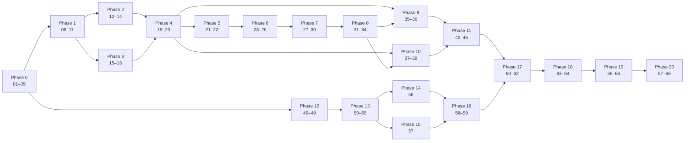

# Support Ticket Management System — Implementation Plan

| Status | Last updated | Related |
|--------|--------------|---------|
| Draft — awaiting review | 2026-09-26 | [`requirements.md`](requirements.md), [`architecture.md`](architecture.md), [`data-model.md`](data-model.md), [`api-contract.md`](api-contract.md), [`state-machine.md`](state-machine.md), [`test-strategy.md`](test-strategy.md), [spec review](../docs/reviews/2026-09-26-spec-review.md) |

This plan turns the approved specifications into **68 small, ordered, independently reviewable steps** (`STEP-nn`).
Each step is meant to be one pull request. It is small enough to review in under an hour, leaves the build green, and
ships with its own tests.

---

## 0. How to use this plan

### 0.1 Working agreement for every step

1. **One step = one branch = one PR**, titled `STEP-nn: <title>`. Conventional commits.
2. **Test-first where practical:** write the tests named in *Tests required* and see them fail, then implement.
3. **Definition of done** (applies to every step, in addition to its own acceptance criteria):
   - `./gradlew build` passes (backend steps) or `npm run lint && npm run typecheck && npm run test` passes
     (frontend steps).
   - The AI-code verification checklist in `rules/ai-assisted-development.md` §3 is completed in the PR description.
   - No behaviour beyond the step's objective. Spec documents are updated in the same PR if the step changes or
     clarifies behaviour.
   - Reviewed with `commands/review-code.md`. No open `blocker`/`major` findings.
4. Steps with no dependency on each other can run in parallel (§3).

### 0.2 About the specification review

The specs are approved for planning, but the [spec review](../docs/reviews/2026-09-26-spec-review.md) left
**4 blockers** (SR-01…SR-04) that make some behaviour impossible to implement exactly as written. **Phase 0**
resolves them as specification-only changes, with no code. Each Phase 0 step proposes a default, which the user
confirms before it is applied. Later steps are written against those defaults and cite the SR id where one applies.

---

## 1. Phase overview

| Phase | Steps | Outcome |
|-------|-------|---------|
| 0 — Pre-implementation decisions | 01–05 | Review blockers resolved. Versions pinned. `openapi.yaml` written |
| 1 — Project setup | 06–11 | Git repo, Gradle backend skeleton, profiles, test infrastructure, ArchUnit, CI |
| 2 — Database and migrations | 12–14 | Flyway `V1`, `V2`, vendor locations, H2 profile |
| 3 — Domain model | 15–18 | Enums, limits, normalisation, exceptions, `Ticket`, `Comment` |
| 4 — Repository layer | 19–20 | Spring Data repositories, projections, comment paging |
| 5 — Ticket service | 21–22 | Create, get, update, assign use cases |
| 6 — State machine | 23–26 | Transition table, `changeStatus`, service use case, enforcement rules |
| 7 — REST API | 27–30 | DTOs, mapper, ticket endpoints |
| 8 — Validation and error handling | 31–34 | Problem Details handler, strict validation, correlation ids, request limits |
| 9 — Comments | 35–36 | Comment use cases and endpoints |
| 10 — Search/filter | 37–39 | Escaping, specifications, sorting, list parameters |
| 11 — Backend tests | 40–45 | HTTP state-machine matrix, concurrency, integration, contract validation, restart, coverage gate |
| 12 — Frontend setup | 46–49 | Next.js scaffold, typed API client, UI primitives, frontend CI |
| 13 — Frontend ticket management | 50–55 | List, create, details, edit, assignee, status actions |
| 14 — Frontend comments | 56 | Comment list and form |
| 15 — Frontend search/filter | 57 | Search, status filter, URL state |
| 16 — UI error handling | 58–59 | Consolidated error UX, accessibility, XSS |
| 17 — Integration/E2E | 60–62 | Full-stack compose, Playwright scenarios, E2E in CI |
| 18 — Security/configuration review | 63–64 | Security review, configuration review |
| 19 — Documentation | 65–66 | READMEs, spec/ADR sync |
| 20 — Final review | 67–68 | Full review, fixes, release |

---

## 2. Steps

### Phase 0 — Pre-implementation decisions (specification changes only)

#### STEP-01 — Product assumption sign-off (SR-01)
- **Objective:** get explicit confirmation or change for every product-level assumption, so tests assert approved
  behaviour. The assumptions are A-4, A-13, A-14, A-15, A-17, A-18, A-19, A-20, A-21, A-24, A-30, DM-1…DM-8, API-1,
  API-2, API-7, SM-2…SM-4, plus SR-12 (deployment boundary), SR-17 (NFRs, UI message catalogue), SR-18 (missing
  requirements) and SR-31 (UI default filter).
- **Files:** `spec/requirements.md` (new "Confirmed decisions" and "Non-functional requirements" sections), the
  affected assumption rows in all `spec/*.md`, `docs/adr/0002-deployment-boundary-no-auth.md`.
- **Depends on:** —
- **Acceptance criteria:** every listed assumption is marked *Confirmed* or *Changed* with a date. Changed ones are
  propagated to every spec. NFRs are measurable (p95 latency target, WCAG level, supported browsers). A UI message
  catalogue exists (error `code` → user text → placement).
- **Tests required:** none (documentation). Run `commands/review-spec.md` on the changed files.

#### STEP-02 — Contract semantics corrections (SR-02, SR-03, SR-10, SR-11, SR-14, SR-19, SR-20, SR-21, SR-22, SR-23)
- **Objective:** make the API contract implementable and internally consistent. Proposed defaults:
  - SR-02: `null` = absent in `PATCH`. A missing `assignee` key = `null` (unassign).
  - SR-03: enum fields bound as strings and checked by an enum constraint, unknown properties collected and reported
    as `UNKNOWN_FIELD`, **all** field errors reported together, scalar coercion disabled.
  - SR-10: `currentVersion` optional.
  - SR-11: `Location` is a relative URI.
  - SR-14: all current-state rejections → `409` with a specific `code`. No-op rules made consistent.
  - SR-19: comment `Location` removed.
  - SR-20: timestamps always serialised with 6 fractional digits.
  - SR-21: ids ≤ 2⁵³−1.
  - SR-22: first `sort` used, extras → 400.
  - SR-23: add `NOT_ACCEPTABLE` (406) and `PAYLOAD_TOO_LARGE` (413), and define the empty-body precedence.
- **Files:** `spec/api-contract.md`, `spec/architecture.md` §10, §11, §14, §17, `spec/state-machine.md`,
  `spec/test-strategy.md` §7, §8, `rules/api-standards.md`.
- **Depends on:** STEP-01 (terminal-state rules affect SR-14).
- **Acceptance criteria:** no contradiction remains between these documents on null handling, error aggregation,
  status codes or headers. Every affected test case in `test-strategy.md` is updated.
- **Tests required:** none (documentation). `commands/review-spec.md` passes with no blocker.

#### STEP-03 — Database, portability and test-spec corrections (SR-05, SR-06, SR-07, SR-08, SR-09, SR-15, SR-16, SR-26, SR-28, SR-32)
- **Objective:** fix the database and test specifications. Proposed defaults:
  - SR-05: database collation pinned (UTF-8 plus explicit collation), and lower-casing done in SQL on both sides.
  - SR-06: character rules. NUL and C0 control characters rejected, Unicode whitespace definition.
  - SR-07: H2 length semantics corrected.
  - SR-08: `PESSIMISTIC_READ` on the ticket when adding a comment.
  - SR-16: timestamp clamping.
  - SR-15: search-test decoys added.
  - SR-09, SR-28: a test hook for deterministic interleaving and failure injection.
  - SR-32: ArchUnit rule scope limited to production classes.
  - SR-26: document inconsistencies aligned.
- **Files:** `spec/data-model.md`, `spec/architecture.md` §9, §12, §16, `spec/state-machine.md` §5, §9, §12,
  `spec/test-strategy.md` §4–§6, §9, `rules/java-springboot.md` §5.
- **Depends on:** STEP-01.
- **Acceptance criteria:** each listed SR item is marked resolved in the review file with a link to the change.
- **Tests required:** none (documentation).

#### STEP-04 — Pin versions (SR-24)
- **Objective:** record exact major/minor versions and re-check every API the specs name against them. Covers Java 21,
  Spring Boot, Hibernate, Jackson (2 vs 3), Flyway (+ `flyway-database-postgresql`), Testcontainers, the PostgreSQL
  image tag, ArchUnit, JaCoCo, Node LTS, Next.js, React, TanStack Query, React Hook Form, openapi-typescript, Vitest,
  MSW and Playwright.
- **Files:** `docs/adr/0003-pinned-versions.md`. Wording updates in `spec/architecture.md` §3, §17, §18 and
  `spec/test-strategy.md` where an API name changes.
- **Depends on:** —
- **Acceptance criteria:** each named API (`@MockitoBean`, `@ServiceConnection`, structured logging, the Jackson
  unknown-property/coercion settings, Testcontainers PostgreSQL module) has been confirmed to exist in the pinned
  version, with a documentation link.
- **Tests required:** none (documentation).

#### STEP-05 — Write `spec/openapi.yaml` and choose the contract validator (SR-04)
- **Objective:** produce the machine-readable OpenAPI 3.1 contract and make it the single normative source.
  `api-contract.md` references its schemas.
- **Files:** `spec/openapi.yaml` (new), `spec/api-contract.md` (header and cross-references),
  `rules/api-standards.md` §7, `docs/adr/0004-openapi-single-source.md`.
- **Depends on:** STEP-02, STEP-04.
- **Acceptance criteria:**
  - Every endpoint, parameter, schema, enum, error code, extension property and example from `api-contract.md` is
    present.
  - The file passes an OpenAPI linter (e.g. Redocly or Spectral) with zero errors.
  - A response-validation library that supports OAS 3.1 is chosen and verified with a spike (TS-2).
  - `openapi-typescript` generates types without errors.
- **Tests required:** linter run documented in the PR. Spike result recorded in the ADR.

---

### Phase 1 — Project setup

#### STEP-06 — Initialise the repository
- **Objective:** turn the folder into a git repository with repository hygiene in place.
- **Files:** `.git/`, `.gitignore` (exists), `.editorconfig`, `.gitattributes` (LF, symlinks), `README.md` (stub),
  `.env.example`.
- **Depends on:** —
- **Acceptance criteria:**
  - `git init` done and `main` is the default branch.
  - The initial commit contains the existing docs, specs and rules.
  - The `.cursor/` and `.claude/` symlinks are committed as symlinks.
  - `.env.example` lists every variable from `architecture.md` §17 with dummy values.
  - A secret scan (e.g. gitleaks) is clean.
- **Tests required:** gitleaks run is clean.

#### STEP-07 — Backend Gradle skeleton
- **Objective:** a minimal Spring Boot application that builds with Gradle (Kotlin DSL), the Java 21 toolchain, the
  version catalog and a separate `integrationTest` suite.
- **Files:** `backend/settings.gradle.kts`, `backend/build.gradle.kts`, `backend/gradle/libs.versions.toml`,
  `backend/gradlew*`, `backend/gradle/wrapper/*`, `backend/src/main/java/com/supportdesk/SupportDeskApplication.java`,
  `backend/src/main/resources/application.yml`.
- **Depends on:** STEP-04, STEP-06.
- **Acceptance criteria:**
  - `./gradlew build` runs `test` + `integrationTest` + JaCoCo report (aggregated over both suites).
  - Versions come only from the catalog or the Boot BOM.
  - The toolchain is pinned to 21.
  - No application features exist yet.
- **Tests required:** one `@SpringBootTest` context-load test in `integrationTest` (it needs the database from STEP-09,
  so it is initially disabled with a linked TODO to STEP-09). One trivial unit test proves the `test` suite runs.

#### STEP-08 — Configuration, profiles and local database
- **Objective:** set up the profiles (`local`, `h2`, `test`, `prod`) and the typed settings. Also:
  - `@ConfigurationProperties(prefix="supportdesk")` record with `@Validated`
  - a microsecond-truncated `Clock` bean
  - strict Jackson settings as decided in STEP-02
  - OSIV off, `ddl-auto=validate`, `hibernate.jdbc.time_zone=UTC`, actuator limited to `health`/`info`
  - docker-compose PostgreSQL with the collation from STEP-03
- **Files:** `backend/src/main/resources/application*.yml`, `backend/src/main/java/com/supportdesk/shared/config/*`,
  `docker-compose.yml`, `.env.example`.
- **Depends on:** STEP-07, STEP-03.
- **Acceptance criteria:**
  - `docker compose up db` followed by the `local` profile starts the app.
  - The `prod` profile fails fast when `SPRING_DATASOURCE_PASSWORD` is missing.
  - Invalid `supportdesk.*` settings fail at startup.
  - No secrets or defaults for secrets in any committed file.
- **Tests required:** TS-UNIT-12 (config validation). A unit test for the clock truncation. A Jackson configuration
  test covering an unknown property, scalar coercion, and the timestamp format with 6 fractional digits.

#### STEP-09 — Backend test infrastructure
- **Objective:** shared test support:
  - one singleton Testcontainers PostgreSQL container (pinned image and collation) wired through `@ServiceConnection`
  - a mutable test `Clock`
  - an integration-test base class that truncates tables before each test
  - fixture skeletons (`TicketFixtures`, `ApiFixtures`)
  - the transaction test hook interface from STEP-03, with a no-op production implementation
- **Files:** `backend/src/integrationTest/java/com/supportdesk/support/*`,
  `backend/src/test/java/com/supportdesk/support/*`, `backend/src/main/java/com/supportdesk/shared/tx/*` (hook).
- **Depends on:** STEP-07, STEP-08.
- **Acceptance criteria:**
  - The container starts once per JVM.
  - `integrationTest` fails fast with a clear message when Docker is unavailable, with no H2 fallback.
  - The STEP-07 context-load test is enabled and passes.
- **Tests required:** the context-load IT. A self-test proving the container reports the expected encoding and
  collation.

#### STEP-10 — ArchUnit baseline
- **Objective:** encode the layering rules before any feature code exists, so every later step is checked.
- **Files:** `backend/src/test/java/com/supportdesk/architecture/ArchitectureTest.java`.
- **Depends on:** STEP-07.
- **Acceptance criteria:** these rules are active, scoped to production classes (SR-32):
  - `architecture.md` §5.2 dependency table
  - no field injection
  - no `@Transactional` in `..api..`
  - `domain` has no dependency on Spring Web

  Empty packages pass, and adding a deliberate violation fails the build.
- **Tests required:** TS-ARCH-01…05 (the rules that can apply at this stage. Entity-specific rules are added in
  STEP-26).

#### STEP-11 — Backend CI pipeline
- **Objective:** CI runs stages 1–3 of `test-strategy.md` §14 on every push, plus a secret scan.
- **Files:** `.github/workflows/backend.yml` (⚠ assumes GitHub Actions; see §5).
- **Depends on:** STEP-07, STEP-09.
- **Acceptance criteria:**
  - The pipeline runs `./gradlew build` with Docker available.
  - Test reports and the JaCoCo report are uploaded as artifacts.
  - The pipeline fails on a failing test.
  - Dependency caching is enabled.
- **Tests required:** a pipeline run on the PR is green, and a deliberately failing test shows red (verified once,
  then reverted).

---

### Phase 2 — Database and migrations

#### STEP-12 — Migration `V1__create_ticket.sql`
- **Objective:** create the `ticket` table exactly as in `data-model.md` §3, with all its constraints and indexes.
- **Files:** `backend/src/main/resources/db/migration/common/V1__create_ticket.sql`.
- **Depends on:** STEP-09, STEP-03.
- **Acceptance criteria:**
  - Portable SQL only (`data-model.md` §14): `TIMESTAMP WITH TIME ZONE`, `varchar(n)`, named constraints.
  - The header comment links the spec.
  - The migration applies cleanly to the Testcontainers database.
- **Tests required:**
  - TS-REPO-01 (applies)
  - TS-REPO-02 for every `ck_ticket_*` constraint, including `ck_ticket_status_timestamps` (all 5 valid status rows
    accepted, invalid combinations rejected)
  - TS-REPO-04 (identity, explicit id rejected)

#### STEP-13 — Migration `V2__create_ticket_comment.sql`
- **Objective:** create the `ticket_comment` table, its FK and its index as in `data-model.md` §4.
- **Files:** `backend/src/main/resources/db/migration/common/V2__create_ticket_comment.sql`.
- **Depends on:** STEP-12.
- **Acceptance criteria:** the FK is `ON DELETE RESTRICT`, and `ix_ticket_comment_ticket_created` exists.
- **Tests required:** TS-REPO-02 (comment constraints), TS-REPO-03 (FK: unknown ticket rejected, delete restricted).

#### STEP-14 — Flyway locations, seed data and H2 profile
- **Objective:** set `spring.flyway.locations` with the `{vendor}` folder, an empty `db/migration/postgresql`,
  repeatable seed scripts for `local`/`h2` only, `clean-disabled` everywhere except tests, and the `h2` profile
  (in-memory, PostgreSQL mode, lower-case identifiers, NULLs sorted high).
- **Files:** `application*.yml`, `db/migration/postgresql/.gitkeep`, `db/seed/R__demo_tickets.sql`.
- **Depends on:** STEP-13.
- **Acceptance criteria:**
  - The `local` profile loads seed data. The `test`/`prod` profiles do not.
  - The `h2` profile starts and applies the `common` migrations.
  - Seed data only reaches states legally, meaning its status/timestamp combinations are valid.
- **Tests required:** H2 startup smoke (initial version of TS-INT-08: context loads and migrations apply). A test
  asserting seed scripts are absent under the `test` profile.

---

### Phase 3 — Domain model

#### STEP-15 — Enums, field limits and text normalisation
- **Objective:** `TicketPriority` (values + rank), `TicketStatus` (values + lifecycle rank only; transitions come in
  STEP-23), a `FieldLimits` constants class, and a `TextNormalizer` implementing trim, blank and control-character
  rules (STEP-03) and blank-assignee → `null`.
- **Files:** `backend/src/main/java/com/supportdesk/ticket/domain/{TicketPriority,TicketStatus,FieldLimits,TextNormalizer}.java`.
- **Depends on:** STEP-10, STEP-03.
- **Acceptance criteria:** the limits equal `data-model.md` §7 and `openapi.yaml`, with one constant per limit.
- **Tests required:** TS-UNIT-07 (normalisation incl. NBSP, tabs, NUL, internal whitespace preserved), TS-UNIT-09
  (ranks).

#### STEP-16 — Error codes and domain exceptions
- **Objective:** the `ErrorCode` enum (code, HTTP status, `type` URI, title) matching `openapi.yaml`, and the
  exception hierarchy `DomainException` → `NotFoundException`/`TicketNotFoundException`,
  `InvalidStatusTransitionException`, `BusinessRuleViolationException`, `ConcurrentModificationException`, each
  carrying its extension data.
- **Files:** `backend/src/main/java/com/supportdesk/shared/error/ErrorCode.java`,
  `.../shared/error/DomainException.java`, `.../ticket/domain/exception/*`.
- **Depends on:** STEP-05, STEP-10.
- **Acceptance criteria:** every code in the contract's catalogue is present exactly once. The exceptions are
  unchecked and immutable.
- **Tests required:** TS-UNIT-10 (catalogue matches the contract, codes unique).

#### STEP-17 — `Ticket` aggregate (without status transitions)
- **Objective:** the JPA entity with field access, `@Version` and no setters. Behaviour:
  - `create(...)`: status `OPEN`, clock timestamps, default priority
  - `updateDetails(...)`: partial update, no-op detection
  - `assign(...)`
  - terminal-state edit guard and `ensureCommentable()`
  - defensive invariants
  - timestamp clamping (SR-16)
- **Files:** `backend/src/main/java/com/supportdesk/ticket/domain/Ticket.java`,
  `backend/src/test/java/.../ticket/domain/TicketFixtures.java`.
- **Depends on:** STEP-15, STEP-16.
- **Acceptance criteria:** there is no way to set `status` other than `create` (and STEP-24). Guards throw
  `BusinessRuleViolationException` with the correct code per STEP-02, and leave the entity unchanged.
- **Tests required:** TS-UNIT-02, TS-UNIT-03, TS-UNIT-04, TS-UNIT-05, TS-UNIT-06. A clamping unit test.

#### STEP-18 — `Comment` entity
- **Objective:** an immutable JPA entity mapped to `ticket_comment` with a factory taking `ticketId`, `author`, `body`
  and the clock. The ticket reference is by id or a lazy `@ManyToOne`, with no collection on `Ticket`.
- **Files:** `backend/src/main/java/com/supportdesk/ticket/domain/Comment.java`, `CommentFixtures.java`.
- **Depends on:** STEP-15.
- **Acceptance criteria:** there are no mutators, and author and body are normalised and validated defensively.
- **Tests required:** unit tests for the factory, normalisation and invariants.

---

### Phase 4 — Repository layer

#### STEP-19 — Repositories and mapping validation
- **Objective:** `TicketRepository` and `CommentRepository` (Spring Data JPA). Confirms that Hibernate `validate`
  accepts the entity mapping against the V1/V2 schema.
- **Files:** `backend/src/main/java/com/supportdesk/ticket/persistence/{TicketRepository,CommentRepository}.java`.
- **Depends on:** STEP-13, STEP-17, STEP-18.
- **Acceptance criteria:**
  - The application context starts with `validate`.
  - Save and load round-trip every field.
  - Enums are stored by name.
  - `version` increments on update.
- **Tests required:** TS-REPO-05 (timestamps, including a non-UTC JVM default zone), TS-REPO-06 (optimistic lock with
  two persistence contexts), and a round-trip test for every column.

#### STEP-20 — List projection and comment paging queries
- **Objective:** a summary projection for the ticket list (without description) and a paged query of comments by
  ticket, ordered by `created_at, id`. Also the pessimistic-read lookup for adding comments (SR-08).
- **Files:** `TicketRepository.java`, `CommentRepository.java`, `.../persistence/TicketSummaryProjection.java`.
- **Depends on:** STEP-19.
- **Acceptance criteria:** listing issues one content query plus one count query, with no description loaded. The
  comment query excludes other tickets' comments and is stable across pages. The pessimistic lookup issues
  `FOR SHARE` (verified by SQL log in the test).
- **Tests required:** TS-REPO-07 (query count via Hibernate statistics), TS-REPO-08. A lock-mode test.

---

### Phase 5 — Ticket service

#### STEP-21 — Commands, views, and the create/get use cases
- **Objective:** command and view records, and `TicketService.create` plus `getDetails` (read-only). Views are built
  inside the transaction, and an unknown id raises `TicketNotFoundException`.
- **Files:** `backend/src/main/java/com/supportdesk/ticket/application/{TicketService,command/*,view/*}.java`.
- **Depends on:** STEP-20.
- **Acceptance criteria:** the service never returns entities. The views include `allowedTransitions`: temporarily
  `[]`/placeholder until STEP-23, and marked as such.
- **Tests required:** TS-SVC-01, TS-SVC-02 (get), TS-SVC-10 (transaction annotations for these methods).

#### STEP-22 — Update-details and assign use cases
- **Objective:** `TicketService.updateDetails` and `TicketService.assign`, each with the explicit version check
  before any mutation, the terminal guard, and no-op semantics per STEP-02.
- **Files:** `TicketService.java`, `command/UpdateTicketCommand.java`, `command/AssignTicketCommand.java`.
- **Depends on:** STEP-21.
- **Acceptance criteria:** a stale version → `ConcurrentModificationException` before any change. A no-op update
  leaves `version`/`updatedAt` unchanged.
- **Tests required:** TS-SVC-02 (update/assign unknown id), TS-SVC-03, TS-SVC-07.

---

### Phase 6 — State-machine implementation

#### STEP-23 — `TicketStatus` transition table
- **Objective:** an immutable transition table in `TicketStatus`, with `canTransitionTo`, `allowedTargets()` (ordered
  per `state-machine.md` §4) and `isTerminal()`. Replaces the STEP-21 placeholder for `allowedTransitions` in views.
- **Files:** `ticket/domain/TicketStatus.java`, `ticket/application/view/*` (allowed transitions).
- **Depends on:** STEP-15, STEP-21.
- **Acceptance criteria:** the table exactly matches `state-machine.md` §4 (5 allowed, 20 rejected). Every constant
  has an entry.
- **Tests required:** TS-UNIT-01, TS-SM-M1 (all 25 pairs, parameterised from the spec table, plus the count,
  ordering, terminal ⇔ empty and completeness checks).

#### STEP-24 — `Ticket.changeStatus`
- **Objective:** the only status mutator. It checks legality through `TicketStatus`, throws
  `InvalidStatusTransitionException` (with current status, target and allowed transitions) **before** any mutation,
  and on success sets the status, `updatedAt` and the matching lifecycle timestamp (with clamping).
- **Files:** `ticket/domain/Ticket.java`, `TicketFixtures.java` (walk-to-state helpers using legal transitions only).
- **Depends on:** STEP-23, STEP-17.
- **Acceptance criteria:** behaviour matches `state-machine.md` §3 and §8. A rejected transition leaves the entity
  byte-for-byte unchanged.
- **Tests required:**
  - domain level: **TS-SM-A1…A5** and **TS-SM-R1 (CLOSED→OPEN), R2 (RESOLVED→OPEN), R3 (CANCELLED→OPEN)**, R4…R8
  - TS-SM-M2 (all 20 rejected pairs, entity unchanged)
  - TS-SM-M4 (full paths)

#### STEP-25 — `TicketService.changeStatus`
- **Objective:** the status-change use case. It loads the ticket, checks the version first, calls
  `ticket.changeStatus`, flushes so the view carries the new version, and maps the view. The STEP-09 transaction hook
  is invoked between the domain change and the flush.
- **Files:** `TicketService.java`, `command/ChangeStatusCommand.java`.
- **Depends on:** STEP-24, STEP-22.
- **Acceptance criteria:** version precedence per `state-machine.md` §6.1. The service does not catch or re-check
  transition rules.
- **Tests required:** TS-SVC-03 (transition), TS-SVC-04 (stale version + illegal target → concurrency error),
  TS-SVC-05, TS-SVC-06.

#### STEP-26 — Enforcement rules (ArchUnit)
- **Objective:** make the enforcement guarantees in `state-machine.md` §5 machine-checked:
  - E3: no public status setter, and status is written only in `create`/`changeStatus`
  - E5: only `ticket.application` uses `TicketRepository`
  - `InvalidStatusTransitionException` is constructed only in `domain`
  - no entity types in `api` signatures
- **Files:** `ArchitectureTest.java`.
- **Depends on:** STEP-25.
- **Acceptance criteria:** all rules pass. Each rule has been shown failing against a deliberate violation (then
  reverted).
- **Tests required:** TS-SM-E6, TS-ARCH-01…05 (complete set).

---

### Phase 7 — REST API

#### STEP-27 — DTOs, mapper and page response
- **Objective:** request and response records matching `openapi.yaml` (strings for enums per STEP-02, plus an
  unknown-field sink), `PageResponse<T>`, and `TicketApiMapper` (request → command, view → response).
- **Files:** `ticket/api/dto/*`, `ticket/api/TicketApiMapper.java`, `shared/web/PageResponse.java`.
- **Depends on:** STEP-25, STEP-05.
- **Acceptance criteria:** every response property is present, nullable properties serialise as `null`, and
  timestamps use the STEP-02 format.
- **Tests required:** TS-UNIT-11. JSON serialisation tests comparing against `openapi.yaml` examples.

#### STEP-28 — Create, get and basic list endpoints
- **Objective:** `POST /api/v1/tickets` (`201` + **relative** `Location`), `GET /api/v1/tickets/{ticketId}`, and
  `GET /api/v1/tickets` with paging and default sort only (search and filter arrive in STEP-39).
- **Files:** `ticket/api/TicketController.java`.
- **Depends on:** STEP-27.
- **Acceptance criteria:** thin controller, one service call per endpoint, no `@Transactional`.
- **Tests required:** TS-WEB-01, TS-WEB-02, TS-WEB-03, TS-WEB-04 for these endpoints.

#### STEP-29 — `PATCH` ticket and `PUT` assignee endpoints
- **Objective:** `PATCH /api/v1/tickets/{ticketId}` and `PUT /api/v1/tickets/{ticketId}/assignee`, with the null
  semantics from STEP-02.
- **Files:** `TicketController.java`.
- **Depends on:** STEP-28, STEP-22.
- **Acceptance criteria:** `assignee`/`status` in a PATCH body is rejected (the full error shape arrives in STEP-32).
  Responses return the updated ticket.
- **Tests required:** TS-WEB-01/02/03 for these endpoints. TS-SM-E2, TS-SM-E3 (initially asserting 400 status only,
  completed in STEP-32).

#### STEP-30 — Status-transition endpoint
- **Objective:** `POST /api/v1/tickets/{ticketId}/status-transitions` returning `200 TicketResponse`.
- **Files:** `TicketController.java` (or a dedicated `TicketStatusController.java`).
- **Depends on:** STEP-28, STEP-25.
- **Acceptance criteria:** the endpoint delegates to `TicketService.changeStatus` only, with no transition logic in
  the web layer.
- **Tests required:** TS-WEB-01/02/03 for this endpoint. A web-slice check that a mocked
  `InvalidStatusTransitionException` produces a 409 (the full body is verified in STEP-31).

---

### Phase 8 — Validation and error handling

#### STEP-31 — Global exception handler and Problem Details
- **Objective:** `GlobalExceptionHandler` (extends `ResponseEntityExceptionHandler`) plus a `ProblemDetailFactory`.
  It produces the exact error shape from `openapi.yaml` for every code: extensions, `errors: []`, `instance`,
  `timestamp` and `correlationId`. It never leaks internals, and it logs by severity (4xx without a stack trace,
  5xx with one).
- **Files:** `shared/error/{GlobalExceptionHandler,ProblemDetailFactory,FieldErrorDto}.java`.
- **Depends on:** STEP-16, STEP-30.
- **Acceptance criteria:** covers every code except the validation specifics (STEP-32) and 413/406 (STEP-34). DB
  constraint violations → `500 INTERNAL_ERROR`, logged with the constraint name. The auto-configured error handler is
  not active (SR-25).
- **Tests required:** TS-ERR-01 (the codes covered so far), TS-ERR-02, TS-ERR-03, TS-ERR-04, TS-ERR-06, TS-ERR-07,
  TS-ERR-10.

#### STEP-32 — Request validation and error aggregation
- **Objective:** Bean Validation annotations built from the `FieldLimits` constants, enum-membership constraints,
  unknown-field reporting, strict JSON types, `NO_CHANGES_REQUESTED`, and path/query validation (`location: path` /
  `query`). All field errors are aggregated into one response, and the `api-contract.md` §1.3 precedence is
  implemented.
- **Files:** `ticket/api/dto/*`, `shared/error/*`, `shared/validation/*` (enum constraint), `TicketController.java`
  (`@Validated`).
- **Depends on:** STEP-31.
- **Acceptance criteria:** every row of `test-strategy.md` §7 produces the exact `(location, field, code)` set. No
  submitted value is echoed back.
- **Tests required:** TS-VAL-01…11, TS-VAL-20, TS-VAL-30…32, TS-ERR-05 (precedence pairs), TS-ERR-08, TS-SM-E1…E4
  (complete).

#### STEP-33 — Correlation id and logging
- **Objective:** a `CorrelationIdFilter` that validates or generates the id, puts it in the MDC, echoes it in the
  response header and exposes it to the Problem Details factory. Log configuration: console for `local`, JSON for
  `prod`, SQL at DEBUG in `local` only. Business-event INFO logs (created, status changed) contain no text content.
- **Files:** `shared/web/CorrelationIdFilter.java`, `logback-spring.xml` or the Boot structured-logging config,
  `TicketService.java` (event logs).
- **Depends on:** STEP-31.
- **Acceptance criteria:** the error body `correlationId` equals the response header. Descriptions and comment bodies
  never appear in logs.
- **Tests required:** TS-WEB-06. A log-capture test asserting no ticket text appears in logs for create, update and
  comment.

#### STEP-34 — Request limits and content negotiation (SR-12, SR-23)
- **Objective:** a maximum request body size (default from STEP-01, e.g. 64 KB) → `413 PAYLOAD_TOO_LARGE`, and
  `406 NOT_ACCEPTABLE` / `415` mapped to Problem Details.
- **Files:** `application.yml`, `shared/error/GlobalExceptionHandler.java`, `shared/web/*` if a filter is needed.
- **Depends on:** STEP-31.
- **Acceptance criteria:** an oversized body is rejected before JSON parsing. The codes match the contract.
- **Tests required:** web-slice tests for 413, 406 and 415 (TS-ERR-01 completion).

---

### Phase 9 — Comments

#### STEP-35 — Comment use cases
- **Objective:** `TicketCommentService.addComment` loads the ticket with `PESSIMISTIC_READ`, calls
  `ensureCommentable`, and saves the comment. It does **not** touch the ticket's version or `updatedAt`.
  `listComments` is read-only, paged and ordered.
- **Files:** `ticket/application/{TicketCommentService,command/AddCommentCommand,view/CommentView}.java`.
- **Depends on:** STEP-20, STEP-17.
- **Acceptance criteria:** adding to a terminal ticket raises the code chosen in STEP-02. An unknown ticket → 404.
- **Tests required:** TS-SVC-08, TS-SVC-02 (comments), TS-UNIT-05 (re-run), TS-SVC-10 (transaction annotations).

#### STEP-36 — Comment endpoints
- **Objective:** `POST /api/v1/tickets/{ticketId}/comments` (`201`, `Location` per STEP-02) and
  `GET /api/v1/tickets/{ticketId}/comments` (default size 50).
- **Files:** `ticket/api/TicketCommentController.java`, `ticket/api/dto/{AddCommentRequest,CommentResponse}.java`.
- **Depends on:** STEP-35, STEP-32.
- **Acceptance criteria:** validation, errors and paging match the contract.
- **Tests required:** TS-WEB-01…04 (comments), TS-VAL-05, TS-ERR-09 (comment part), TS-ERR-10 (comments).

---

### Phase 10 — Search/filter

#### STEP-37 — Search-term escaping and search criteria
- **Objective:** a pure function that escapes `\`, `%` and `_` and wraps the term as `%term%` (lower-casing happens in
  SQL per STEP-03), plus the `TicketSearchCriteria` value object (keyword, de-duplicated statuses).
- **Files:** `ticket/domain/{TicketSearchCriteria,SearchTerm}.java`.
- **Depends on:** STEP-15.
- **Acceptance criteria:** empty or whitespace keyword → no filter. A keyword over 100 characters is rejected by the
  API layer (STEP-39), not here.
- **Tests required:** TS-UNIT-08.

#### STEP-38 — Search and filter specifications and sorting
- **Objective:** `TicketSpecifications`: case-insensitive `lower(col) LIKE lower(:p) ESCAPE '\'` over title and
  description, `status IN (...)`, AND composition, sort by rank using `CASE` expressions for priority and status, and
  an `id` tie-breaker in the same direction.
- **Files:** `ticket/persistence/TicketSpecifications.java`, `TicketRepository.java`.
- **Depends on:** STEP-37, STEP-20.
- **Acceptance criteria:** user input is always a bound parameter. Results are stable across pages.
- **Tests required (repository, PostgreSQL):** TS-SRCH-01…17 (seed data **with decoys** per STEP-03),
  TS-FILT-01…07, TS-FILT-09, TS-REPO-20.

#### STEP-39 — List parameters wired through service and controller
- **Objective:** `GET /tickets` accepts `q`, `status` (repeated and comma-separated), `page`, `size` and `sort`
  (allow-list, first sort only, per STEP-02). `TicketService.search` is read-only.
- **Files:** `TicketController.java`, `TicketService.java`, `ticket/api/ListTicketsParams.java` (or equivalent).
- **Depends on:** STEP-38, STEP-32.
- **Acceptance criteria:** parameter validation matches `test-strategy.md` §7.2.
- **Tests required:** TS-WEB-04 (complete), TS-WEB-05, TS-VAL-21…25, TS-SVC-09, TS-FILT-08.

---

### Phase 11 — Backend tests (cross-cutting suites)

> Unit, slice and repository tests are delivered **with** each step above. Phase 11 adds the suites that span the whole
> backend.

#### STEP-40 — HTTP state-machine suite
- **Objective:** `TicketStatusTransitionIT` over real HTTP and PostgreSQL. It includes the named tests plus the full
  matrix, re-reading the database row after every request.
- **Files:** `backend/src/integrationTest/java/.../ticket/TicketStatusTransitionIT.java`, `ApiFixtures.java`.
- **Depends on:** STEP-30, STEP-32, STEP-09.
- **Acceptance criteria:**
  - Each current state is reached through legal API calls only.
  - A rejected request leaves status, version and all timestamps unchanged in the database.
  - The test names identify the transition (e.g. `rejects CLOSED → OPEN`).
- **Tests required:**
  - HTTP versions of **TS-SM-A1…A5**
  - **TS-SM-R1 (CLOSED→OPEN)**, **TS-SM-R2 (RESOLVED→OPEN)**, **TS-SM-R3 (CANCELLED→OPEN)**, TS-SM-R4…R8
  - TS-SM-M3 (all 25 rows), TS-SM-M4
  - TS-SM-E1…E5 over HTTP

#### STEP-41 — Concurrency and transaction-rollback suite
- **Objective:** deterministic race tests using the STEP-09 hook (SR-09): both requests pass the early version check
  before either commits, and the loser fails at commit time. Covers the comment-vs-close race (SR-08), and rollback
  when a failure is injected before commit (SR-28).
- **Files:** `.../ticket/ConcurrencyIT.java`, `.../ticket/TransactionRollbackIT.java`, test hook implementation.
- **Depends on:** STEP-40, STEP-36.
- **Acceptance criteria:** the tests assert **which** path rejected the loser (early check vs commit time). There are
  no sleeps and no repetition loops.
- **Tests required:** TS-SM-C1…C5, TS-REPO-06 (re-checked through the service), TS-INT-03, and a new comment-vs-close
  race test.

#### STEP-42 — Integration flows and error handling over HTTP
- **Objective:** end-to-end API behaviour per requirement: rejected writes leave no trace, error bodies are correct
  over real HTTP, unknown routes and wrong methods are handled, and the actuator exposes only what it should.
- **Files:** `.../ticket/TicketApiIT.java`, `.../shared/ErrorHandlingIT.java`, `.../shared/ActuatorIT.java`.
- **Depends on:** STEP-39, STEP-36.
- **Acceptance criteria:** every REQ-1…REQ-9 has at least one HTTP-level test.
- **Tests required:** TS-INT-01, TS-INT-02, TS-INT-05, TS-INT-06, TS-INT-07, TS-INT-11, TS-FILT-10.

#### STEP-43 — Contract validation
- **Objective:** validate every request and response in the integration suite against `spec/openapi.yaml` with the
  validator chosen in STEP-05.
- **Files:** `backend/src/integrationTest/java/.../support/ContractValidation*.java`, `build.gradle.kts` (test
  dependency).
- **Depends on:** STEP-42, STEP-05.
- **Acceptance criteria:** any property rename, missing nullable property or undocumented status code fails the build.
  Verified by a deliberate mismatch, then reverted.
- **Tests required:** TS-INT-04.

#### STEP-44 — Persistence/restart and H2 smoke suites
- **Objective:** prove data survives an application restart against the same PostgreSQL container, and that the
  `h2` profile works end to end for the basics.
- **Files:** `.../ticket/PersistenceRestartIT.java`, `.../shared/H2ProfileSmokeIT.java`.
- **Depends on:** STEP-42.
- **Acceptance criteria:** two sequential application contexts share one container. The `h2` smoke covers create,
  get and search.
- **Tests required:** TS-PERS-01…06, TS-INT-08 (complete).

#### STEP-45 — Coverage gate and optional mutation testing
- **Objective:** enforce the JaCoCo thresholds (≥ 80 % line / ≥ 70 % branch on `ticket.domain` and
  `ticket.application`) aggregated over both suites. Optionally add PIT on `ticket.domain` (TS-5).
- **Files:** `backend/build.gradle.kts`.
- **Depends on:** STEP-44.
- **Acceptance criteria:** the build fails below the thresholds. The PIT report shows no surviving mutants in
  `TicketStatus`/`Ticket.changeStatus` (if enabled).
- **Tests required:** gate verified by temporarily excluding a test (then reverted).

---

### Phase 12 — Frontend setup

#### STEP-46 — Next.js scaffold
- **Objective:** a Next.js App Router + TypeScript app with ESLint (including a rule forbidding
  `dangerouslySetInnerHTML`), Prettier, Vitest, React Testing Library, user-event, MSW and vitest-axe. A rewrite
  proxies `/api/*` to `BACKEND_URL` (server-only). Also the root layout, `error.tsx` and `not-found.tsx`.
- **Files:** `frontend/package.json`, `frontend/next.config.*`, `frontend/tsconfig.json`, `frontend/eslint.config.*`,
  `frontend/vitest.config.*`, `frontend/src/app/{layout,error,not-found}.tsx`, `frontend/.env.example`.
- **Depends on:** STEP-04, STEP-06.
- **Acceptance criteria:** `npm run lint`, `typecheck`, `test` and `build` all pass. No `NEXT_PUBLIC_*` secrets.
- **Tests required:** one smoke render test of the layout.

#### STEP-47 — Generated API types, API client and message catalogue
- **Objective:**
  - `schema.d.ts` generated from `spec/openapi.yaml`, with an npm script and a CI check that it is up to date
  - `lib/api/client.ts`: base path `/api/v1`, JSON handling, parsing `problem+json` into a typed `ApiError`
  - `lib/api/errors.ts`: the code → message catalogue from STEP-01
- **Files:** `frontend/src/lib/api/{schema.d.ts,client.ts,errors.ts}`, `frontend/package.json`.
- **Depends on:** STEP-46, STEP-05.
- **Acceptance criteria:** there are no hand-written request/response types, and every error `code` in the contract
  has a catalogue entry (checked by a test).
- **Tests required:** TS-FE-01. A catalogue-completeness test.

#### STEP-48 — Data layer, UI primitives and MSW fixtures
- **Objective:** a TanStack Query provider. Accessible UI primitives (`Button`, `Field` with an `aria-describedby`
  error slot, `Alert`, `Spinner`, `EmptyState`). MSW handlers and fixtures typed against `schema.d.ts`, including
  Problem Details bodies for every code.
- **Files:** `frontend/src/components/ui/*`, `frontend/src/app/providers.tsx`, `frontend/tests/support/*`.
- **Depends on:** STEP-47.
- **Acceptance criteria:** fixtures fail type-checking if they drift from the contract.
- **Tests required:** unit and axe tests for each primitive.

#### STEP-49 — Frontend CI
- **Objective:** a CI workflow running lint, typecheck, test with coverage (≥ 70 % on `features/` and `lib/`, TS-3),
  build, the generated-types freshness check and `npm audit`.
- **Files:** `.github/workflows/frontend.yml`.
- **Depends on:** STEP-48, STEP-11.
- **Acceptance criteria:** the workflow is green on the PR and fails on a type error or failing test.
- **Tests required:** pipeline run.

---

### Phase 13 — Frontend ticket management

#### STEP-50 — Ticket list page
- **Objective:** `/tickets` shows a paged table of summaries with loading, empty and error states, a sort control
  and pagination controls.
- **Files:** `frontend/src/app/tickets/page.tsx`, `frontend/src/features/tickets/{api,hooks,components/TicketTable}.tsx`.
- **Depends on:** STEP-48.
- **Acceptance criteria:** `null` assignee shows as "Unassigned". Timestamps are shown per the STEP-01 time-zone
  decision.
- **Tests required:** TS-FE-03, TS-FE-05.

#### STEP-51 — Create ticket
- **Objective:** `/tickets/new` form (React Hook Form) with client-side length and required hints. Server
  `errors[]` are mapped onto fields, object-level errors shown as a form-level message, and success navigates to the
  details page.
- **Files:** `frontend/src/app/tickets/new/page.tsx`, `features/tickets/components/TicketForm.tsx`,
  `features/tickets/hooks/useCreateTicket.ts`.
- **Depends on:** STEP-50.
- **Acceptance criteria:** client limits come from one constants module that matches the contract.
- **Tests required:** TS-FE-02.

#### STEP-52 — Ticket details page
- **Objective:** `/tickets/[id]` shows all fields, with lifecycle timestamps only when set. `404` shows the not-found
  state.
- **Files:** `frontend/src/app/tickets/[id]/page.tsx`, `features/tickets/components/TicketDetails.tsx`.
- **Depends on:** STEP-50.
- **Acceptance criteria:** the page renders from `TicketResponse` only.
- **Tests required:** TS-FE-06.

#### STEP-53 — Edit details
- **Objective:** inline edit of title, description and priority. It sends only changed fields plus `version`. Save is
  disabled until something changes (SR-30). The form is hidden for terminal tickets.
- **Files:** `features/tickets/components/EditTicketForm.tsx`, `hooks/useUpdateTicket.ts`.
- **Depends on:** STEP-52.
- **Acceptance criteria:** after saving, the cached ticket is replaced with the response, so the version is current.
- **Tests required:** TS-FE-09.

#### STEP-54 — Assignee control
- **Objective:** a separate, immediately-saved assignee control (SR-13 default), supporting assign and unassign.
- **Files:** `features/tickets/components/AssigneeControl.tsx`, `hooks/useAssignTicket.ts`.
- **Depends on:** STEP-52.
- **Acceptance criteria:** it uses the latest cached version. It never shares a save with the details form.
- **Tests required:** TS-FE-10.

#### STEP-55 — Status actions
- **Objective:** `StatusActions` renders one button per entry in `allowedTransitions` (and none for terminal tickets),
  posts to the status-transitions endpoint and updates the cache from the response.
- **Files:** `features/tickets/components/{StatusActions,StatusBadge}.tsx`, `hooks/useChangeStatus.ts`.
- **Depends on:** STEP-52.
- **Acceptance criteria:** there is **no** client-side transition table. The buttons come from the server response
  only.
- **Tests required:** TS-FE-07 (all 5 states).

---

### Phase 14 — Frontend comments

#### STEP-56 — Comments list and form
- **Objective:** a paged comment list (oldest first) and an add-comment form with an author field whose value is
  remembered per browser (SR-29). The form clears on success and is hidden for terminal tickets.
- **Files:** `features/tickets/components/{CommentList,CommentForm}.tsx`, `hooks/{useComments,useAddComment}.ts`.
- **Depends on:** STEP-52.
- **Acceptance criteria:** the remembered author is stored safely (browser storage read/write wrapped in error
  handling). Comment text renders as plain text.
- **Tests required:** TS-FE-11.

---

### Phase 15 — Frontend search/filter

#### STEP-57 — Search, status filter and URL state
- **Objective:** a debounced search box, a status multi-select, and the default filter from STEP-01 (SR-31). List
  state is kept in the URL (`q`, `status`, `page`, `size`, `sort`), and changing a filter resets `page`.
- **Files:** `features/tickets/components/{TicketSearchBar,StatusFilter}.tsx`, `features/tickets/hooks/useTicketListParams.ts`,
  `app/tickets/page.tsx`.
- **Depends on:** STEP-50.
- **Acceptance criteria:** reloading restores the exact list state. The search box enforces the 100-character
  maximum.
- **Tests required:** TS-FE-04.

---

### Phase 16 — UI error handling

#### STEP-58 — Consolidated error UX
- **Objective:** one error-presentation layer used by every feature:
  - field mapping and the form-level summary
  - `409 TICKET_CONCURRENT_MODIFICATION`: Reload prompt, keeping unsaved input
  - `409` invalid transition: show `detail`, refetch, re-render the actions
  - terminal-state rejections: message
  - `404`: not-found view
  - `5xx`/network: retryable alert with `correlationId`
  - route-level `error.tsx`
- **Files:** `frontend/src/lib/api/errors.ts`, `frontend/src/components/ui/ErrorAlert.tsx`,
  `features/tickets/hooks/*` (error handling), `app/error.tsx`.
- **Depends on:** STEP-53, STEP-54, STEP-55, STEP-56, STEP-57.
- **Acceptance criteria:** every error `code` has exactly one presentation rule, following the STEP-01 catalogue.
  Raw response text is never rendered.
- **Tests required:** TS-FE-08, TS-FE-12, plus a parameterised test over every `code`.

#### STEP-59 — Accessibility and injection hardening
- **Objective:** axe checks on every page, keyboard navigation for forms and actions, focus moving to the error
  summary on submit failure, and a check that ticket and comment text containing HTML renders inert.
- **Files:** page and component tests, `eslint.config.*`.
- **Depends on:** STEP-58.
- **Acceptance criteria:** no axe violations at the WCAG level from STEP-01.
- **Tests required:** TS-FE-13, TS-FE-14.

---

### Phase 17 — Integration/E2E testing

#### STEP-60 — Full-stack local environment
- **Objective:** Dockerfiles for the backend and frontend (multi-stage, non-root), and a `docker compose` profile that
  runs database + backend + frontend, plus a test-only database reset script for E2E.
- **Files:** `backend/Dockerfile`, `frontend/Dockerfile`, `docker-compose.yml` (profile `e2e`),
  `e2e/scripts/reset-db.sh`.
- **Depends on:** STEP-45, STEP-59.
- **Acceptance criteria:** `docker compose --profile e2e up` serves the app on one origin. The PostgreSQL volume
  persists across `down`/`up` (TS-PERS-08 checklist).
- **Tests required:** a manual checklist recorded in the PR. Health checks pass.

#### STEP-61 — Playwright E2E scenarios
- **Objective:** Playwright (Chromium) scenarios against the compose stack.
- **Files:** `e2e/playwright.config.ts`, `e2e/tests/*.spec.ts`, `e2e/package.json`.
- **Depends on:** STEP-60.
- **Acceptance criteria:** each scenario starts from a reset database. No fixed sleeps. Traces are captured on
  failure.
- **Tests required:** TS-E2E-01…06 (06 = `CLOSED → OPEN` sent directly through the API → 409).

#### STEP-62 — E2E in CI
- **Objective:** run E2E on pull requests to `main` and nightly (TS-4). Upload Playwright traces as artifacts.
- **Files:** `.github/workflows/e2e.yml`.
- **Depends on:** STEP-61.
- **Acceptance criteria:** the workflow is green, with at most one retry and the trace reviewed.
- **Tests required:** pipeline run.

---

### Phase 18 — Security/configuration review

#### STEP-63 — Security review
- **Objective:** a structured security pass over the whole system, recorded as a review report:
  - secret scanning
  - dependency audit (OWASP Dependency-Check, `npm audit`), added as a nightly CI job
  - SQL injection review of all queries
  - error-leakage check
  - log PII check
  - CORS allow-list
  - actuator exposure
  - request-size limit
  - Docker images run as non-root
  - HTTP security headers on the Next.js responses
  - the deployment-boundary ADR from STEP-01 honoured
- **Files:** `docs/reviews/YYYY-MM-DD-security-review.md`, `.github/workflows/security.yml`, fixes in affected modules.
- **Depends on:** STEP-62.
- **Acceptance criteria:** no unresolved high/critical findings. Each finding is fixed or explicitly accepted by the
  user.
- **Tests required:** a regression test for every fixed finding. TS-ERR-06 and TS-FE-14 re-run.

#### STEP-64 — Configuration review
- **Objective:** verify every profile and environment variable against `architecture.md` §17:
  - `.env.example` is complete
  - `prod` has no defaults for secrets and fails fast
  - Flyway `clean` is disabled outside tests
  - OSIV is off and `ddl-auto` is `validate` in every profile
  - time zone is UTC
  - the database collation is as pinned
- **Files:** `application*.yml`, `.env.example`, `docker-compose.yml`, `frontend/.env.example`.
- **Depends on:** STEP-63.
- **Acceptance criteria:** there is a configuration matrix (profile × setting) in the backend README, and it matches
  the files.
- **Tests required:** a startup test per profile (`local` with Testcontainers, `h2`, `prod` failing without secrets).

---

### Phase 19 — Documentation

#### STEP-65 — READMEs and developer guide
- **Objective:** a root `README.md` (what it is, architecture summary, quick start, links to `spec/` and `docs/`),
  plus `backend/README.md` and `frontend/README.md` (setup, profiles, commands, tests, troubleshooting). It states
  that the `h2` profile is non-durable (TS-PERS-07).
- **Files:** `README.md`, `backend/README.md`, `frontend/README.md`.
- **Depends on:** STEP-64.
- **Acceptance criteria:** a new developer can run the whole stack and all test suites from the READMEs alone
  (verified by following them on a clean checkout).
- **Tests required:** a documented dry run on a clean checkout.

#### STEP-66 — Specification and ADR synchronisation
- **Objective:** make the specs describe the as-built system:
  - close every assumption (confirmed, changed, or deferred with a reason)
  - add changelog entries
  - record the decisions made during implementation as ADRs
  - update `docs/prompt-history.md` if entries are missing
  - regenerate the traceability tables
- **Files:** `spec/*.md`, `spec/openapi.yaml`, `docs/adr/*`.
- **Depends on:** STEP-65.
- **Acceptance criteria:** `commands/review-spec.md` finds no inconsistency between the specs and the code. All specs
  have status *Approved*.
- **Tests required:** contract validation (STEP-43) still green.

---

### Phase 20 — Final review

#### STEP-67 — Final code review and traceability audit
- **Objective:** a full review with `commands/review-code.md` over the whole codebase, plus a traceability audit:
  every REQ and every acceptance criterion maps to passing tests, and every test ID in `test-strategy.md` exists in
  code or is explicitly deferred.
- **Files:** `docs/reviews/YYYY-MM-DD-final-review.md`.
- **Depends on:** STEP-66.
- **Acceptance criteria:** the report lists findings with severities. The traceability matrix is complete. The full
  pipeline (backend, frontend, E2E) is green on `main`.
- **Tests required:** the entire suite, run and reported.

#### STEP-68 — Fixes and release
- **Objective:** resolve every `blocker`/`major` finding from STEP-67 (each fix with a regression test), re-run the
  full pipeline, and tag `v1.0.0` with release notes.
- **Files:** as required by the findings. `CHANGELOG.md`.
- **Depends on:** STEP-67.
- **Acceptance criteria:** no open blocker or major findings. The release notes list known limitations (e.g. no
  authentication, and deferred assumptions).
- **Tests required:** a regression test per fix. The full pipeline is green.

---

## 3. Dependencies and parallelism

- **Critical path (backend):** 01 → 02 → 05 → 07 → 09 → 12 → 13 → 17 → 19 → 20 → 21 → 22 → 23 → 24 → 25 → 27 → 28 →
  30 → 31 → 32 → 39 → 42 → 43 → 44 → 45 → 60 → 61 → …
- **Parallel tracks:**
  - The frontend (Phases 12–16) starts once `openapi.yaml` exists (STEP-05), developing against MSW mocks.
  - Comments (Phase 9) and search/filter (Phase 10) can proceed in parallel after STEP-32.
  - STEP-15 and STEP-16 can run in parallel with Phase 2.
- **Integration point:** Phase 17 is the first time the real frontend talks to the real backend. The contract-typed
  MSW fixtures (STEP-48) and contract validation (STEP-43) exist to make that a non-event.

---

## 4. Traceability: requirements → steps

| Requirement | Implemented in | Verified in |
|-------------|----------------|-------------|
| REQ-1 Create ticket | 17, 21, 27, 28, 51 | 17, 21, 28, 32, 42, 51, 61 |
| REQ-2 List tickets | 20, 28, 39, 50 | 20, 28, 38, 39, 50 |
| REQ-3 View details | 21, 28, 52 | 21, 28, 42, 52 |
| REQ-4 Update fields + assignee | 17, 22, 29, 53, 54 | 17, 22, 29, 32, 53, 54 |
| REQ-5 Add comments | 18, 35, 36, 56 | 35, 36, 41, 56, 61 |
| REQ-6 Search | 37, 38, 39, 57 | 37, 38, 57, 61 |
| REQ-7 Filter by status | 38, 39, 57 | 38, 39, 42, 57, 61 |
| REQ-8 Persistence | 12, 13, 14, 19 | 12, 13, 19, 44 |
| REQ-9 Backend validation | 15, 17, 32 | 15, 17, 32, 12 (DB constraints) |
| REQ-10 Meaningful UI errors | 01 (catalogue), 31, 47, 58 | 31, 47, 58, 61 |
| REQ-11 Allowed transitions | 23, 24, 25, 30, 55 | 23, 24, 40, 55, 61 |
| REQ-12 Reject invalid transitions | 23, 24, 26, 32 | 24, 26, 40, 41, 61 |

---

## 5. Assumptions and risks

| ID | Item | Mitigation |
|----|------|------------|
| IP-1 | CI runs on **GitHub Actions** with Docker-enabled runners (TS-6) | If another CI is used, STEP-11/49/62 change only in their workflow files |
| IP-2 | Phase 0 defaults are accepted as proposed. A different answer may add or remove steps (e.g. a tri-state DTO instead of the SR-02 default) | The user confirms Phase 0 before STEP-07 starts. The plan is updated in the same PR |
| IP-3 | Docker is available on developer machines | The `h2` profile allows UI work without Docker. Integration tests still need Docker |
| IP-4 | The OAS 3.1 contract-validation library may not support every construct used | The STEP-05 spike decides. The fallback is generating OAS 3.0 for validation only |
| IP-5 | Pinned framework versions may make some spec'd API names obsolete (SR-24) | STEP-04 re-checks every named API before code is written |
| IP-6 | The frontend could drift from the backend before Phase 17 | Generated types (STEP-47), contract-typed MSW fixtures (STEP-48) and backend contract validation (STEP-43) |
| IP-7 | Step sizes are estimates. A step that grows beyond one reviewable PR is split rather than merged oversized | Reviewer rejects oversized PRs |

## Changelog

- 2026-09-26 — Initial draft.
