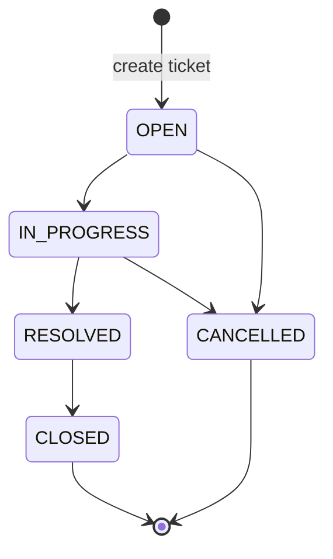
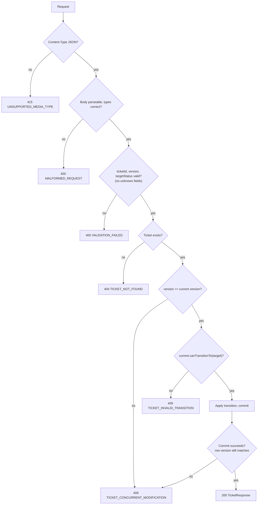

# Support Ticket Management System — Ticket State Machine

| Status | Last updated | Related |
|--------|--------------|---------|
| Draft — awaiting review | 2026-09-25 | [`requirements.md`](requirements.md) REQ-11, REQ-12, [`architecture.md`](architecture.md) §8, §16, [`data-model.md`](data-model.md) §8, §10.3, §11, [`api-contract.md`](api-contract.md) §3.1, §6.9 |

This document is the **single normative definition** of the ticket lifecycle. The domain enum `TicketStatus`, the
database constraints, the API's `allowedTransitions`, and every state-machine test are derived from it. Changing the
lifecycle means changing this document first (§13).

> Decisions not fixed by the requirements are marked **⚠ A-n** (see `architecture.md` §20) or **⚠ SM-n** (new, §14).

---

## 1. States

| State | Meaning | Initial? | Terminal? | Lifecycle timestamp set on entry |
|-------|---------|----------|-----------|----------------------------------|
| `OPEN` | Created, not yet being worked on | **Yes**, the only initial state | No | — (`createdAt`) |
| `IN_PROGRESS` | Someone is working on it | No | No | — |
| `RESOLVED` | A fix or answer has been provided | No | No | `resolvedAt` |
| `CLOSED` | Work is complete and confirmed | No | **Yes** | `closedAt` |
| `CANCELLED` | Abandoned or invalid, will not be worked on | No | **Yes** | `cancelledAt` |

A terminal state has **no outgoing transitions**. There is no way out of `CLOSED` or `CANCELLED`.

## 2. State diagram



## 3. Allowed transitions

| ID | From | To | Side effects on success |
|----|------|----|-------------------------|
| T1 | `OPEN` | `IN_PROGRESS` | `status`, `updatedAt`, `version + 1` |
| T2 | `IN_PROGRESS` | `RESOLVED` | + `resolvedAt` set |
| T3 | `RESOLVED` | `CLOSED` | + `closedAt` set (`resolvedAt` kept) |
| T4 | `OPEN` | `CANCELLED` | + `cancelledAt` set |
| T5 | `IN_PROGRESS` | `CANCELLED` | + `cancelledAt` set |

**Every other (from, to) pair is rejected**, including self-transitions (⚠ A-21) and `RESOLVED → IN_PROGRESS`
(reopen, ⚠ A-20). There are no guard conditions beyond the current state: for example, no assignee is required to
start work (⚠ A-19).

## 4. Transition matrix

All 5 × 5 = 25 combinations. This table is the test oracle for §12.

| # | Current state | Requested state | Result | Rule |
|---|---------------|-----------------|--------|------|
| 1 | `OPEN` | `OPEN` | ❌ Rejected | Self-transition |
| 2 | `OPEN` | `IN_PROGRESS` | ✅ **Allowed** | T1 |
| 3 | `OPEN` | `RESOLVED` | ❌ Rejected | Must pass through `IN_PROGRESS` |
| 4 | `OPEN` | `CLOSED` | ❌ Rejected | Must be `RESOLVED` first |
| 5 | `OPEN` | `CANCELLED` | ✅ **Allowed** | T4 |
| 6 | `IN_PROGRESS` | `OPEN` | ❌ Rejected | No moving backwards |
| 7 | `IN_PROGRESS` | `IN_PROGRESS` | ❌ Rejected | Self-transition |
| 8 | `IN_PROGRESS` | `RESOLVED` | ✅ **Allowed** | T2 |
| 9 | `IN_PROGRESS` | `CLOSED` | ❌ Rejected | Must be `RESOLVED` first |
| 10 | `IN_PROGRESS` | `CANCELLED` | ✅ **Allowed** | T5 |
| 11 | `RESOLVED` | `OPEN` | ❌ Rejected | No reopening (REQ-12 example) |
| 12 | `RESOLVED` | `IN_PROGRESS` | ❌ Rejected | No reopening (⚠ A-20) |
| 13 | `RESOLVED` | `RESOLVED` | ❌ Rejected | Self-transition |
| 14 | `RESOLVED` | `CLOSED` | ✅ **Allowed** | T3 |
| 15 | `RESOLVED` | `CANCELLED` | ❌ Rejected | Only `OPEN`/`IN_PROGRESS` can be cancelled |
| 16 | `CLOSED` | `OPEN` | ❌ Rejected | Terminal (REQ-12 example) |
| 17 | `CLOSED` | `IN_PROGRESS` | ❌ Rejected | Terminal |
| 18 | `CLOSED` | `RESOLVED` | ❌ Rejected | Terminal |
| 19 | `CLOSED` | `CLOSED` | ❌ Rejected | Terminal / self-transition |
| 20 | `CLOSED` | `CANCELLED` | ❌ Rejected | Terminal |
| 21 | `CANCELLED` | `OPEN` | ❌ Rejected | Terminal (REQ-12 example) |
| 22 | `CANCELLED` | `IN_PROGRESS` | ❌ Rejected | Terminal |
| 23 | `CANCELLED` | `RESOLVED` | ❌ Rejected | Terminal |
| 24 | `CANCELLED` | `CLOSED` | ❌ Rejected | Terminal |
| 25 | `CANCELLED` | `CANCELLED` | ❌ Rejected | Terminal / self-transition |

**Totals:** 5 allowed, 20 rejected.

Compact form, which is also the value of `allowedTransitions` per state, in this order:

| Current | Allowed targets |
|---------|-----------------|
| `OPEN` | `IN_PROGRESS`, `CANCELLED` |
| `IN_PROGRESS` | `RESOLVED`, `CANCELLED` |
| `RESOLVED` | `CLOSED` |
| `CLOSED` | *(none)* |
| `CANCELLED` | *(none)* |

---

## 5. Enforcement: one path, every client

**Rule:** the backend enforces the state machine **no matter where a request comes from**: the Next.js UI, Postman,
curl, a script, or another service. The UI hiding buttons is a convenience, not a control.

This is guaranteed structurally, not by convention:

| # | Guarantee | How |
|---|-----------|-----|
| E1 | **Exactly one API operation changes status** | `POST /api/v1/tickets/{ticketId}/status-transitions` ([`api-contract.md`](api-contract.md) §6.9) |
| E2 | **No other endpoint accepts `status`** | `POST /tickets` always creates `OPEN`, and `status` in the body → `400 UNKNOWN_FIELD`. `PATCH /tickets/{id}` and `PUT /tickets/{id}/assignee` reject `status` with `400 UNKNOWN_FIELD` |
| E3 | **Exactly one code path changes status** | `Ticket.changeStatus(target, clock)` in the domain. The status field has no setter, and JPA accesses the field directly. `Ticket.create(…)` hard-codes `OPEN` |
| E4 | **One transition table** | An immutable table inside `TicketStatus` (`canTransitionTo`, `allowedTargets`, `isTerminal`). Nothing else (controller, service, frontend, SQL) stores its own copy |
| E5 | **All callers go through the application service** | Internal Java callers (future jobs, event listeners, other features) call `TicketService.changeStatus`, never the repository with a hand-modified entity. ArchUnit forbids `api` → `persistence` and anything outside `ticket.application` depending on `TicketRepository` |
| E6 | **The database backs it up** | `ck_ticket_status` (only the 5 values) and `ck_ticket_status_timestamps` (status and lifecycle timestamps must agree, [`data-model.md`](data-model.md) §10.3) reject rows that a bypassing code path would produce |
| E7 | **The UI derives rather than decides** | The UI renders actions from `allowedTransitions` in the response, which the backend computes from E4 |

**Out of scope:** direct SQL against the production database by an operator bypasses the application. E6 limits
the damage, but transitions themselves cannot be expressed as row-level `CHECK`s. Prevent this with database access
control and by never granting the app's DB role to people.

---

## 6. Requesting a transition (API)

From [`api-contract.md`](api-contract.md) §6.9:

```
POST /api/v1/tickets/{ticketId}/status-transitions
Content-Type: application/json

{ "version": 2, "targetStatus": "RESOLVED" }
```

| Field | Rules |
|-------|-------|
| `ticketId` (path) | int64 ≥ 1 |
| `version` | Required, int64 ≥ 0. The version the client last read |
| `targetStatus` | Required, one of the 5 `TicketStatus` values (case-sensitive) |

### 6.1 Processing order (deterministic)



**The version check comes before the legality check.** A client with a stale view is told its data is stale, not that
its move is illegal. The move might be legal from the actual current state, or illegal for a reason the client can't
see. Either way, the right response is to refetch.

---

## 7. Responses

### 7.1 Success — `200 OK`

Body: `TicketResponse` ([`api-contract.md`](api-contract.md) §4.1) reflecting the **committed** state.

| Property | Value after success |
|----------|---------------------|
| `status` | `targetStatus` |
| `version` | previous + 1 |
| `updatedAt` | transition time (server `Clock`, µs precision) |
| `resolvedAt` / `closedAt` / `cancelledAt` | set per §3. Earlier timestamps are unchanged |
| `allowedTransitions` | allowed targets of the **new** state (§4 compact table) |
| everything else | unchanged |

Example: `IN_PROGRESS → RESOLVED` on ticket 42 at version 2:

```json
{
  "id": 42,
  "title": "Cannot log in to portal",
  "description": "User reports a 403 after password reset.",
  "priority": "HIGH",
  "status": "RESOLVED",
  "assignee": "maria.lopez",
  "createdAt": "2026-09-25T09:00:00Z",
  "updatedAt": "2026-09-25T11:42:10.250Z",
  "resolvedAt": "2026-09-25T11:42:10.250Z",
  "closedAt": null,
  "cancelledAt": null,
  "version": 3,
  "allowedTransitions": ["CLOSED"]
}
```

### 7.2 Rejected transition — `409 Conflict`

`application/problem+json`, with the common structure from [`api-contract.md`](api-contract.md) §2:

```json
{
  "type": "https://supportdesk.example/problems/ticket-invalid-transition",
  "title": "Invalid status transition",
  "status": 409,
  "detail": "Ticket 42 cannot move from RESOLVED to OPEN.",
  "instance": "/api/v1/tickets/42/status-transitions",
  "code": "TICKET_INVALID_TRANSITION",
  "correlationId": "0b6c1e0a-2f7d-4a63-8c9e-3d1b2a4f5e60",
  "timestamp": "2026-09-25T11:45:00Z",
  "errors": [],
  "ticketId": 42,
  "currentStatus": "RESOLVED",
  "targetStatus": "OPEN",
  "allowedTransitions": ["CLOSED"]
}
```

- `detail` format: `Ticket {id} cannot move from {currentStatus} to {targetStatus}.` It is safe to display.
- **Nothing changes**: no write, no `version` bump, no `updatedAt` change.

### 7.3 Other errors on this endpoint

| Status | `code` | Cause |
|--------|--------|-------|
| 400 | `MALFORMED_REQUEST` | Unparseable JSON, wrong JSON types |
| 400 | `VALIDATION_FAILED` | `version`/`targetStatus` missing or invalid (e.g. `"targetStatus": "REOPENED"` → `INVALID_VALUE`), bad `ticketId`, unknown property |
| 404 | `TICKET_NOT_FOUND` | Unknown `ticketId` |
| 409 | `TICKET_CONCURRENT_MODIFICATION` | `version` stale (§9) |
| 415 | `UNSUPPORTED_MEDIA_TYPE` | Non-JSON body |
| 500 | `INTERNAL_ERROR` | Unexpected. Includes a DB constraint violation, which would indicate a bug |

An **unknown** target value such as `REOPENED` is an input error (400). A **known** value that isn't reachable is a
state-machine rejection (409).

---

## 8. Business exception

| Aspect | Definition |
|--------|------------|
| Name | `InvalidStatusTransitionException` (package `ticket.domain.exception`) |
| Hierarchy | `DomainException` (abstract, unchecked) → `InvalidStatusTransitionException` |
| Thrown by | `Ticket.changeStatus` only, after `TicketStatus.canTransitionTo` returns false. Never by controllers or services |
| Carries | `ticketId`, `currentStatus`, `targetStatus`, `allowedTransitions` (from `currentStatus.allowedTargets()`) |
| Error code | `ErrorCode.TICKET_INVALID_TRANSITION` → HTTP 409 |
| Mapped by | `GlobalExceptionHandler` → Problem Details §7.2. Extension properties come from the exception fields |
| State on throw | Thrown **before** any field is modified, so the entity is never left half-changed |
| Transaction | Unchecked, so the surrounding transaction rolls back. There's nothing to undo, but the rollback guarantees no flush happens |
| Logging | `WARN` with ticket id, from→to and correlation id. No stack trace, because this is an expected client error |

Related exceptions on this path, for completeness:

| Exception | Thrown by | Code / HTTP |
|-----------|-----------|-------------|
| `TicketNotFoundException` | `TicketService` (lookup) | `TICKET_NOT_FOUND` / 404 |
| `ConcurrentModificationException` (project type, not `java.util`) | `TicketService` on version mismatch before mutation | `TICKET_CONCURRENT_MODIFICATION` / 409 |
| Spring `ObjectOptimisticLockingFailureException` | JPA at flush/commit when the row version changed after load | Mapped to the same `TICKET_CONCURRENT_MODIFICATION` / 409 |

---

## 9. Concurrency considerations

The ticket row is protected by **optimistic locking** (`version` column, JPA `@Version`).

### 9.1 Two layers of version checking

1. **Explicit check (early):** the service compares `request.version` with the loaded entity's `version`. A stale
   client is rejected immediately with a clear 409, before the transition logic runs.
2. **Implicit check (at commit):** Hibernate issues
   `UPDATE ticket SET …, version = :v+1 WHERE id = :id AND version = :v`. If another transaction committed in between
   (after load, before commit), zero rows are updated. Hibernate throws, the transaction rolls back, and the result is
   409 `TICKET_CONCURRENT_MODIFICATION`.

Layer 2 closes the race window that layer 1 alone leaves open. Layer 1 alone would be a time-of-check/time-of-use bug.

### 9.2 Scenarios

| # | Scenario | Outcome |
|---|----------|---------|
| C1 | Two clients both read v2 (`IN_PROGRESS`). A sends `RESOLVED`, B sends `CANCELLED`, at the same time | Exactly **one** succeeds (`200`, v3). The other gets `409 TICKET_CONCURRENT_MODIFICATION`. After refetching, B sees the true state and its allowed transitions |
| C2 | Two clients send the **same** transition (`OPEN → IN_PROGRESS`, v0) at the same time | One `200`. The other `409 TICKET_CONCURRENT_MODIFICATION`. No double transition, no duplicate side effects |
| C3 | Client retries after a timeout, but the first attempt had actually committed | The retry carries the old version → `409 TICKET_CONCURRENT_MODIFICATION`. The UI refetches and sees the transition already happened. Transitions are therefore **safe to retry** (effectively idempotent via versioning) |
| C4 | Client A edits the title (v2 → v3) while B changes status with v2 | B → `409 TICKET_CONCURRENT_MODIFICATION`. Any ticket modification bumps `version`, so B must refetch |
| C5 | A comment is added while a status change is in flight | Independent. Comments don't take part in ticket versioning (⚠ A-34). The comment follows the "commentable" rule as seen in its own transaction. Accepted for v1 |
| C6 | Client sends a stale version **and** an illegal target | `409 TICKET_CONCURRENT_MODIFICATION` (version is checked first, §6.1) |

### 9.3 Why not pessimistic locking

Status changes are rare, short and user-driven, so conflicts are unlikely and cheap to resolve by refetching.
`SELECT … FOR UPDATE` would serialise writers but adds lock waits, and it doesn't tell a user with a stale screen that
their view is outdated. Optimistic locking does both jobs. Revisit only if automated high-frequency writers appear
(⚠ SM-1).

---

## 10. Persistence behaviour

| Aspect | Behaviour |
|--------|-----------|
| Rows written on success | **One** `UPDATE` of the `ticket` row: `status`, `updated_at`, one lifecycle timestamp (T2–T5), `version`. No `INSERT`s in v1 (no history table, ⚠ SM-2) |
| Rows written on rejection | **None**. The transaction rolls back and no SQL is flushed |
| Timestamps | Taken once per transition from the injected `Clock` (µs-truncated). The same instant is used for `updated_at` and the lifecycle column |
| DB safety net | `ck_ticket_status` and `ck_ticket_status_timestamps` ([`data-model.md`](data-model.md) §10). A violation means a code bug → 500, logged with the constraint name |
| Enum storage | `varchar` holding the enum name (`EnumType.STRING`) |
| Read-after-write | The response is built from the entity **inside** the transaction after the change, so it shows exactly what was committed. `version` in the response is the post-increment value because the service flushes before mapping |

---

## 11. Transaction boundary

| Aspect | Definition |
|--------|------------|
| Boundary | `TicketService.changeStatus(ChangeStatusCommand)`, annotated `@Transactional` (read-write). **One transition = one transaction** |
| Inside the transaction | Load ticket by id → version check → `ticket.changeStatus(target, clock)` → flush (version increment) → map to `TicketDetailsView` |
| Outside the transaction | Request parsing and validation (controller), view → response DTO mapping, Problem Details rendering |
| Rollback | Any exception (all project exceptions are unchecked) rolls back. There are no partial writes |
| Isolation | Database default (READ COMMITTED). Correctness relies on the optimistic lock, not on isolation level |
| Not inside | No HTTP calls, messaging or other slow I/O. Future notifications on status change use an after-commit event listener (`architecture.md` §19), so a rejected or rolled-back transition never triggers one |
| Controllers | Never `@Transactional`. Never call the repository |

---

## 12. Testing strategy

Every level below maps to [`rules/testing.md`](../rules/testing.md). The **§4 matrix is the oracle**, so tests are
data-driven from its 25 rows. If a transition is accidentally added or removed, at least one test fails.

### 12.1 Domain unit tests (`./gradlew test`, no Spring)

| Test | Cases |
|------|-------|
| `TicketStatusTest`: transition table | Parameterised over **all 25 pairs** from §4. Asserts `canTransitionTo` = expected. A separate check asserts exactly 5 `true` results |
| `TicketStatusTest`: allowed targets | `allowedTargets()` for each state equals the compact table, **in order** |
| `TicketStatusTest`: terminal | `isTerminal()` true only for `CLOSED`, `CANCELLED`. Every terminal state has empty `allowedTargets()` |
| `TicketStatusTest`: completeness | Every enum constant has an entry in the table, so a newly added status fails until the table is updated |
| `TicketTest`: allowed transitions | For T1–T5: status updated, `updatedAt` = clock instant, correct lifecycle timestamp set, others untouched |
| `TicketTest`: rejected transitions | For all 20 rejected pairs: `InvalidStatusTransitionException` with correct `currentStatus`, `targetStatus`, `allowedTransitions`, **and the entity is unchanged** (status, timestamps) |
| `TicketTest`: creation | A new ticket is `OPEN` with no lifecycle timestamps |
| `TicketTest`: full paths | `OPEN→IN_PROGRESS→RESOLVED→CLOSED` keeps `resolvedAt` when closing. `OPEN→CANCELLED` and `OPEN→IN_PROGRESS→CANCELLED` |

Tickets in a given state are built with a test fixture that walks legal transitions. There is no reflection-based
status setting, so fixtures cannot create impossible states.

### 12.2 Application service unit tests (Mockito)

- Unknown id → `TicketNotFoundException`. The domain is not invoked.
- Version mismatch → `ConcurrentModificationException`, raised **before** `changeStatus`, even when the target is also
  illegal (C6).
- Happy path delegates to `Ticket.changeStatus` with the injected `Clock` and returns a view with the new version.
- Invalid transition propagates `InvalidStatusTransitionException` unchanged. The service does not catch it or
  re-check the rules.

### 12.3 Web-slice tests (`@WebMvcTest`)

- Request validation: missing `version`/`targetStatus` → `400 VALIDATION_FAILED` with the exact
  `(location, field, code)` tuples. `targetStatus: "REOPENED"` / `"open"` → `INVALID_VALUE`. Unknown property →
  `UNKNOWN_FIELD`. `ticketId=abc`/`0` → `path` error. Malformed JSON → `MALFORMED_REQUEST`. Wrong media type → `415`.
- Error mapping: a mocked service throwing each exception in §8 → correct status, `application/problem+json`,
  `code`, and extensions (`currentStatus`, `targetStatus`, `allowedTransitions`, `currentVersion`).
- Bypass guards (E2): `status` in `POST /tickets`, `PATCH /tickets/{id}` and `PUT /tickets/{id}/assignee` bodies
  → `400 UNKNOWN_FIELD`.

### 12.4 Integration tests (`./gradlew integrationTest`, Testcontainers PostgreSQL)

| Test | What it proves |
|------|----------------|
| **HTTP matrix**: all 25 rows of §4 through the real API | Each case creates a ticket, drives it to the *current state* via legal API calls, then requests the target. It asserts `200` + new state, or `409 TICKET_INVALID_TRANSITION` + unchanged row, **re-read from the database** (status, version, timestamps) |
| Lifecycle timestamps persisted | `resolvedAt`/`closedAt`/`cancelledAt` stored and returned correctly, UTC, µs precision |
| Stale version | Transition with an old version → `409 TICKET_CONCURRENT_MODIFICATION`. Row unchanged |
| **Concurrent transitions (C1, C2)** | Two threads, same version, released together by a latch → exactly one `200` and one `409 TICKET_CONCURRENT_MODIFICATION`. Final row has `version + 1` |
| Retry after success (C3) | Repeating the same request → `409 TICKET_CONCURRENT_MODIFICATION` |
| Not found | Unknown id → `404` |
| DB safety net (E6) | Raw SQL `UPDATE` producing an inconsistent status/timestamp combination (e.g. `CLOSED` with `closed_at` null) is rejected by `ck_ticket_status_timestamps` |
| Bypass via other endpoints | `PATCH` / `PUT assignee` / `POST` create cannot change status (400), and a successful `PATCH` leaves `status` unchanged |

### 12.5 Architecture tests (ArchUnit)

- `Ticket` exposes no public method that sets status other than `changeStatus`, and no `setStatus`.
- Controllers don't depend on `persistence`. Only `ticket.application` depends on `TicketRepository`.
- `InvalidStatusTransitionException` is constructed only inside `ticket.domain`.

### 12.6 Frontend tests

- Status action buttons are rendered **only** from `allowedTransitions`. For each of the 5 states, the rendered
  actions equal the compact table. Terminal states show no actions.
- On `409 TICKET_INVALID_TRANSITION`: `detail` shown, ticket refetched, buttons re-rendered.
- On `409 TICKET_CONCURRENT_MODIFICATION`: reload prompt shown.

### 12.7 Traceability

| Requirement | Tests |
|-------------|-------|
| REQ-11 (allowed transitions) | 12.1 matrix + T1–T5, 12.4 HTTP matrix (5 allowed rows) |
| REQ-12 (reject others, incl. `CLOSED→OPEN`, `RESOLVED→OPEN`, `CANCELLED→OPEN`) | 12.1 matrix (20 rejected rows), 12.4 HTTP matrix rows 11, 16, 21 explicitly named, 12.3 bypass guards |

---

## 13. Changing the state machine

Adding, removing or conditioning a transition (e.g. allowing reopen, A-20) requires, **in one change**:

1. Update this document: §3, the §4 matrix (the oracle), the diagram, and the timestamp rules.
2. Update `api-contract.md` §3.1 (`allowedTransitions`).
3. Update the transition table in `TicketStatus` and any side effects in `Ticket.changeStatus`.
4. If lifecycle timestamps are affected: a new Flyway migration replacing `ck_ticket_status_timestamps`
   ([`data-model.md`](data-model.md) §10.3). For reopen, decide whether `resolvedAt` is cleared or kept.
5. Tests update automatically because they are driven by the matrix data. Adjust the expected counts (5 allowed / 20 rejected).
6. Run `commands/review-spec.md` on the changed documents first.

---

## 14. Assumptions and open questions

Carried (product decisions, still to confirm in the functional spec): **A-19** (no assignee required),
**A-20** (no reopen `RESOLVED → IN_PROGRESS`), **A-21** (self-transitions rejected with 409), **A-22** (lifecycle
timestamps), **A-34** (comments don't take part in ticket versioning).

New:

| ID | Assumption | Default | Resolve in |
|----|-----------|---------|------------|
| SM-1 | Optimistic locking is sufficient. No automated high-frequency status writers in v1 | Optimistic only | Spec (NFR) |
| SM-2 | No persisted transition history or audit log in v1. `updatedAt` and lifecycle timestamps only | No history | **Spec**. Cheap to add later in `Ticket.changeStatus` (architecture §19) |
| SM-3 | No reason or comment is required when cancelling or resolving | Not required | **Spec** |
| SM-4 | No automatic transitions (e.g. auto-close `RESOLVED` after N days, auto-start on assignment) | None | **Spec** |

## Changelog

- 2026-09-25 — Initial draft.
