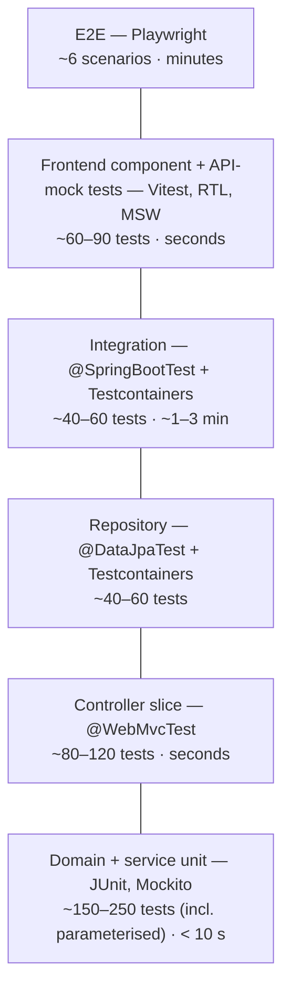

# Support Ticket Management System — Test Strategy

| Status | Last updated | Related |
|--------|--------------|---------|
| Draft — awaiting review | 2026-09-26 | [`requirements.md`](requirements.md), [`architecture.md`](architecture.md) §15, [`data-model.md`](data-model.md), [`api-contract.md`](api-contract.md), [`state-machine.md`](state-machine.md) §12, [`rules/testing.md`](../rules/testing.md) |

This document defines **what** is tested, **at which level**, **with which tools**, and **which defects each level is
responsible for catching**. [`rules/testing.md`](../rules/testing.md) sets the binding style and tooling rules. This
document applies them to this system. Test cases carry stable IDs (`TS-<area>-<n>`) so the implementation plan,
code-review reports and test reports can refer to them.

> Assumptions are marked **⚠ TS-n** (§17). Product assumptions from the other specs (A-n, DM-n, API-n, SM-n) are
> tested **as currently written**. When one is resolved differently, the affected cases here change with it.

---

## 1. Principles

1. **Tests are derived from the spec, not from the code.** Expected values come from the spec documents. If code and
   spec disagree, the test fails and the discrepancy is reported. The test is never adjusted to match the code.
2. **Lowest level that can catch the defect.** Each defect class has an *owner* level (§3). Higher levels re-check
   only the wiring, not every permutation.
3. **Real PostgreSQL for anything that touches SQL.** Testcontainers, never H2 (`data-model.md` §14). H2 is covered
   by exactly one smoke test.
4. **Deterministic.** Fixed/controllable `Clock`, no sleeps, no order dependence, isolated data per test.
5. **The contract is the oracle for API tests.** Status, `Content-Type`, `code`, and the set of
   `(location, field, code)` tuples are asserted. Human-readable text (`detail`, `message`, `title`), `correlationId`
   values and timestamps are not (`api-contract.md` §8.2).
6. **Every test is seen failing once** before it is trusted (`rules/ai-assisted-development.md` §3).

---

## 2. Test pyramid

| Level | Share of test cases | Runs in | Needs | Time budget (⚠ TS-1) |
|-------|---------------------|---------|-------|----------------------|
| Domain + service unit | ~55 % | `./gradlew test` | JVM only | < 30 s |
| Controller slice (+ ArchUnit) | ~20 % | `./gradlew test` | JVM only | (included above) |
| Repository | ~10 % | `./gradlew integrationTest` | Docker | < 3 min total with integration |
| Integration (API → DB) | ~10 % | `./gradlew integrationTest` | Docker | (included above) |
| Frontend | separate pyramid | `npm run test` | Node | < 60 s |
| E2E | ~6 scenarios | `npm run e2e` | Docker + both apps | < 5 min |

**Why this shape:** the valuable logic (state machine, validation, terminal-state rules, search-term escaping) is
pure and cheap to test exhaustively at the bottom. SQL behaviour must be tested against a real database, but those
tests cover query semantics, not business permutations. E2E proves the assembled system works and is kept small
because it is slow and brittle.

---

## 3. Defect classes → owning test level

| Defect class | Example | Owner (must catch) | Backstop |
|--------------|---------|--------------------|----------|
| Wrong business rule | `RESOLVED → OPEN` accepted. Title editable on `CLOSED` ticket | **Domain unit** (§6, §4.1) | Integration HTTP matrix |
| Wrong orchestration | Version not checked. Checked after the transition. Not-found not raised | **Service unit** (§4.2) | Integration |
| HTTP mapping / binding | Wrong status code, missing `Location`, `null` fields omitted, param defaults wrong | **Controller slice** (§4.3) | Integration |
| Input validation gaps | `title` of 201 chars accepted. `size=0` accepted. Unknown field ignored | **Controller slice** (§7) | Domain invariants, DB `CHECK`s |
| Error contract drift | Wrong `code`, wrong `Content-Type`, stack trace in body, precedence wrong | **Controller slice** (§8) | Integration contract validation |
| Query semantics | Search case-sensitive, `%` treated as wildcard, priority sorted alphabetically, unstable paging | **Repository** (§9, §10) | Integration |
| Schema / migration defects | Migration fails on PostgreSQL. Column type ≠ entity (`validate` fails). Missing constraint | **Repository** (§4.4) | App startup in every IT |
| SQL-dialect portability | `common` migration breaks on H2 | **H2 smoke test** (§4.5) | — |
| Transaction / session defects | Lazy loading outside tx. Partial write on rejection. No rollback | **Integration** (§4.5) | — |
| Concurrency | Lost update. Both concurrent transitions succeed | **Integration** (§6.4) | Repository optimistic-lock test |
| Configuration / wiring | Profile misconfigured, Jackson settings not applied, correlation filter missing | **Integration** (§4.5) | E2E |
| Durability | Data lost on restart. Ids reused after restart | **Persistence/restart** (§11) | E2E reload |
| Layering violations | Controller calls repository. Entity leaks into DTO | **ArchUnit** (§4.3) | Code review |
| Frontend rendering / state | Server `errors[]` not shown next to fields. Wrong status buttons. URL filter state lost | **Frontend component** (§12) | E2E |
| Frontend ↔ backend integration | Proxy misrouted, real JSON differs from mocks, browser issues | **E2E** (§13) | — |
| Contract drift (code vs spec) | Response property renamed in code only | **Integration contract validation** (§4.5, ⚠ TS-2) | Frontend MSW fixtures typed from the contract |

---

## 4. Test levels

### 4.1 Unit tests — domain and pure helpers

**Tools:** JUnit 5, AssertJ, `@ParameterizedTest`. **No Spring, no Mockito for domain objects.** **Location:** `backend/src/test/java`.

| ID | Subject | What is verified |
|----|---------|------------------|
| TS-UNIT-01 | `TicketStatus` | Transition table, `allowedTargets()` order, `isTerminal()`, completeness (§6) |
| TS-UNIT-02 | `Ticket.create` | Status `OPEN`. `createdAt == updatedAt` = clock instant. No lifecycle timestamps. `version` unset/0. Priority defaults to `MEDIUM` when not given |
| TS-UNIT-03 | `Ticket.updateDetails` | Changes only the given fields. `updatedAt` bumped only when something changed. No-op leaves `updatedAt` unchanged |
| TS-UNIT-04 | `Ticket.updateDetails` / `assign` in terminal states | `CLOSED`/`CANCELLED` → `BusinessRuleViolationException` (`TICKET_NOT_EDITABLE`), entity unchanged. `OPEN`/`IN_PROGRESS`/`RESOLVED` allowed (⚠ A-17) |
| TS-UNIT-05 | `Ticket.ensureCommentable` | Throws `TICKET_NOT_COMMENTABLE` for `CLOSED`/`CANCELLED` only (⚠ A-18) |
| TS-UNIT-06 | `Ticket` invariants | Defensive checks: blank title/description rejected even when called directly (not via API) |
| TS-UNIT-07 | Text normalisation | Trim. Whitespace-only → blank. Blank assignee → `null` (⚠ DM-4). Internal whitespace preserved |
| TS-UNIT-08 | Search-term escaping | `%` → `\%`, `_` → `\_`, `\` → `\\`. Result wrapped as `%term%`. Lower-cased. Empty/whitespace → "no filter" |
| TS-UNIT-09 | Priority / status rank | Rank order `LOW<MEDIUM<HIGH<URGENT`. Status rank follows lifecycle order |
| TS-UNIT-10 | Error-code catalogue | Every `ErrorCode` has a unique `code`, HTTP status and `type` URI matching `api-contract.md` §2.1 |
| TS-UNIT-11 | API mapper | Request → command and view → response: every field mapped. Nullable fields preserved as `null` |
| TS-UNIT-12 | `@ConfigurationProperties` validation | Invalid config (e.g. max page size < default) fails validation |

### 4.2 Service tests — application layer

**Tools:** JUnit 5, Mockito (`@Mock` repositories), fixed `Clock`. **Scope:** `TicketService`, `TicketCommentService`.

| ID | Case | Expected |
|----|------|----------|
| TS-SVC-01 | Create | Saves a ticket built by `Ticket.create`. Returns a view with `status=OPEN`, `allowedTransitions=[IN_PROGRESS,CANCELLED]` |
| TS-SVC-02 | Get / update / assign / transition / comment with unknown id | `TicketNotFoundException`. No domain method called, nothing saved |
| TS-SVC-03 | Update / assign / transition with stale version | `ConcurrentModificationException` raised **before** any domain mutation |
| TS-SVC-04 | Stale version **and** illegal transition | `ConcurrentModificationException`, not `InvalidStatusTransitionException` (`state-machine.md` C6) |
| TS-SVC-05 | Transition happy path | Delegates to `Ticket.changeStatus(target, clock)`. Returns a view built after flush (new version) |
| TS-SVC-06 | Invalid transition | `InvalidStatusTransitionException` propagates unchanged. The service does not catch it or re-check the rules |
| TS-SVC-07 | Update with no actual change | Returns a view with the same version/`updatedAt` |
| TS-SVC-08 | Add comment | Checks `ensureCommentable` on the loaded ticket, saves the comment with the clock time, and **does not** modify the ticket (⚠ A-34, DM-6) |
| TS-SVC-09 | Search | Builds `TicketSearchCriteria` from trimmed `q`, de-duplicated statuses, paging/sort. Passes them to the repository unchanged |
| TS-SVC-10 | Transaction annotations | Reflection/ArchUnit check: mutating methods are `@Transactional`, and queries are `@Transactional(readOnly = true)` |

### 4.3 Controller tests — web slice

**Tools:** `@WebMvcTest(TicketController.class | TicketCommentController.class)`, MockMvc, `@MockitoBean` services,
the real `GlobalExceptionHandler`, Jackson config and `CorrelationIdFilter` imported.

Covers **routing, binding, serialisation, validation and error mapping** for every endpoint in
`api-contract.md` §5. Validation and error cases are detailed in §7 and §8.

| ID | Case |
|----|------|
| TS-WEB-01 | Each endpoint: method + path → correct service call with correctly mapped command |
| TS-WEB-02 | Success codes: `201` + `Location` for create ticket and create comment. `200` otherwise |
| TS-WEB-03 | Response JSON shape: all properties present, nullable ones as `null`, enums as strings, timestamps ISO-8601 `Z` |
| TS-WEB-04 | List defaults: no params → `page=0,size=20,sort=createdAt,desc`. Comments default `size=50` |
| TS-WEB-05 | `status` binding: repeated and comma-separated forms produce the same criteria |
| TS-WEB-06 | `X-Correlation-Id`: echoed if valid, generated if absent or invalid, always in the response header |
| TS-ARCH-01…05 | **ArchUnit**: layer dependencies (`architecture.md` §5.2). No `@Transactional` in `api`. No entity types in `api` signatures. Only `ticket.application` uses `TicketRepository`. No field injection. `InvalidStatusTransitionException` constructed only in `domain` |

### 4.4 Repository tests

**Tools:** `@DataJpaTest` + `@AutoConfigureTestDatabase(replace = NONE)` + Testcontainers PostgreSQL (same major version
as production, via `@ServiceConnection`). Flyway runs the real migrations. **Location:** `backend/src/integrationTest/java`.

| ID | Case |
|----|------|
| TS-REPO-01 | Flyway applies `V1`, `V2` on an empty database. Hibernate `validate` passes |
| TS-REPO-02 | Each `CHECK` constraint in `data-model.md` §10.1 rejects a violating row (native SQL insert/update). One test per constraint name |
| TS-REPO-03 | `fk_ticket_comment_ticket`: comment with unknown ticket rejected. Deleting a ticket with comments rejected (`RESTRICT`) |
| TS-REPO-04 | Identity: ids generated, increasing. Explicit id insert rejected (`GENERATED ALWAYS`) |
| TS-REPO-05 | Timestamps round-trip exactly (µs precision, UTC), including when the JVM default time zone is not UTC |
| TS-REPO-06 | Optimistic lock: two persistence contexts update the same row. The second flush fails with an optimistic-lock exception |
| TS-REPO-07 | List projection doesn't load `description` or comments. Hibernate statistics show 1 query for content + 1 count query per page (no N+1) |
| TS-REPO-08 | Comments by ticket: ordered by `created_at, id`. Paginated. Other tickets' comments excluded |
| TS-REPO-09…  | Search and filter queries: §9, §10 |
| TS-REPO-20 | Sorting: each allowed sort field × direction. Priority/status sorted by **rank**, not alphabetically. `id` tie-breaker in the same direction |

### 4.5 Integration tests

**Tools:** `@SpringBootTest(webEnvironment = RANDOM_PORT)`, Spring `RestClient`/`TestRestTemplate` over real HTTP,
Testcontainers PostgreSQL (one shared container per JVM), controllable `Clock` bean. The database is truncated between
tests. **Location:** `backend/src/integrationTest/java`, `*IT`.

| ID | Case |
|----|------|
| TS-INT-01 | **REQ-1…5 happy paths**: create → get → list → update → assign → unassign → comment → list comments, re-reading state via API and DB |
| TS-INT-02 | **Rejected write leaves no trace**: for each 4xx on a mutating endpoint, the DB row (status, version, timestamps, fields) and the comment count are unchanged |
| TS-INT-03 | **Transactions**: an injected failure after the domain change but before commit (test-only failing bean) → no partial write |
| TS-INT-04 | **Contract validation** (⚠ TS-2): every response in the IT suite is validated against `spec/openapi.yaml` (schema, required/nullable properties, status codes) |
| TS-INT-05 | Error bodies over real HTTP: `application/problem+json`, `correlationId` equals the header |
| TS-INT-06 | Unknown route → `404 RESOURCE_NOT_FOUND`. Wrong method → `405` + `Allow` |
| TS-INT-07 | Actuator: `/actuator/health` UP. Other actuator endpoints not exposed |
| TS-INT-08 | **H2 smoke**: the app starts with the `h2` profile, `common` migrations apply, create + get + search work (proves portability only, not behaviour) |
| TS-INT-09 | State machine over HTTP: §6.3 |
| TS-INT-10 | Concurrency over HTTP: §6.4 |
| TS-INT-11 | Search / filter / paging over HTTP: a thin end-to-end check of §9 and §10 (the permutations live in repository tests) |

---

## 5. Test data and environment

| Concern | Approach |
|---------|----------|
| Builders | `TicketFixtures` / `CommentFixtures` for domain objects. `ApiFixtures` for request bodies |
| Tickets in a given state | **Always reached by walking legal transitions** (domain: `changeStatus` calls; API: status-transition requests). Never by reflection or raw SQL, so fixtures can't create impossible states. The DB constraint tests (TS-REPO-02) are the only exception, and they are deliberately illegal |
| Time | Unit: `Clock.fixed`. Integration: a mutable test clock bean advanced explicitly, so the order of `createdAt`/`updatedAt` is controlled |
| Isolation | Unit/web: new objects per test. Repository: rolled-back transaction per test (`@DataJpaTest` default). Integration: `TRUNCATE ticket_comment, ticket RESTART IDENTITY` before each test |
| Containers | One PostgreSQL container per test JVM (singleton), started once. Image version pinned in the version catalog |
| Docker unavailable | `integrationTest` fails fast with a clear message. It never falls back to H2 (`rules/testing.md` §4) |
| Secrets | None. Testcontainers credentials are generated |

---

## 6. State-machine tests

The oracle is the 25-row matrix in [`state-machine.md`](state-machine.md) §4. Tests run at **three levels**:
domain (exhaustive, fast), HTTP integration (exhaustive, proves end-to-end enforcement), and frontend (rendering only).

### 6.1 Explicit named tests: allowed transitions

Each is a **standalone, individually named test** at both the domain level and the HTTP level. They are not only rows
in a parameterised table, so a failure names the exact transition in reports.

| ID | Transition | Domain test asserts (`TicketTest`) | HTTP test asserts (`TicketStatusTransitionIT`) |
|----|------------|------------------------------------|-----------------------------------------------|
| TS-SM-A1 | `OPEN → IN_PROGRESS` | status = `IN_PROGRESS`. `updatedAt` = clock. No lifecycle timestamp set | `200`. Body status `IN_PROGRESS`, `version` +1, `allowedTransitions = [RESOLVED, CANCELLED]`. DB row matches |
| TS-SM-A2 | `IN_PROGRESS → RESOLVED` | status = `RESOLVED`. `resolvedAt` = clock | `200`. `resolvedAt` set, `allowedTransitions = [CLOSED]`. DB row matches |
| TS-SM-A3 | `RESOLVED → CLOSED` | status = `CLOSED`. `closedAt` = clock. `resolvedAt` **unchanged** | `200`. `closedAt` set, `resolvedAt` preserved, `allowedTransitions = []` |
| TS-SM-A4 | `OPEN → CANCELLED` | status = `CANCELLED`. `cancelledAt` = clock | `200`. `cancelledAt` set, `allowedTransitions = []` |
| TS-SM-A5 | `IN_PROGRESS → CANCELLED` | status = `CANCELLED`. `cancelledAt` = clock | `200`. `cancelledAt` set, `allowedTransitions = []` |

### 6.2 Explicit named tests: rejected transitions

| ID | Transition | Domain test asserts | HTTP test asserts |
|----|------------|---------------------|-------------------|
| TS-SM-R1 | **`CLOSED → OPEN`** | `InvalidStatusTransitionException(current=CLOSED, target=OPEN, allowed=[])`. Entity unchanged | `409`, `code = TICKET_INVALID_TRANSITION`, `currentStatus = CLOSED`, `targetStatus = OPEN`, `allowedTransitions = []`. DB row unchanged (status, version, all timestamps) |
| TS-SM-R2 | **`RESOLVED → OPEN`** | Exception (current=RESOLVED, target=OPEN, allowed=[CLOSED]). Entity unchanged | `409 TICKET_INVALID_TRANSITION`, `allowedTransitions = [CLOSED]`. DB unchanged |
| TS-SM-R3 | **`CANCELLED → OPEN`** | Exception (current=CANCELLED, target=OPEN, allowed=[]). Entity unchanged | `409 TICKET_INVALID_TRANSITION`, `allowedTransitions = []`. DB unchanged |
| TS-SM-R4 | `RESOLVED → IN_PROGRESS` (reopen, ⚠ A-20) | Exception. Unchanged | `409`. DB unchanged |
| TS-SM-R5 | `OPEN → CLOSED` (skip) | Exception | `409` |
| TS-SM-R6 | `OPEN → RESOLVED` (skip) | Exception | `409` |
| TS-SM-R7 | `RESOLVED → CANCELLED` | Exception | `409` |
| TS-SM-R8 | `OPEN → OPEN` (self, ⚠ A-21) | Exception | `409` |

### 6.3 Exhaustive matrix tests

| ID | Level | Case |
|----|-------|------|
| TS-SM-M1 | Domain (`TicketStatusTest`) | `@ParameterizedTest` over **all 25** `(current, requested, expected)` rows, with the data copied verbatim from `state-machine.md` §4. Plus: exactly 5 pairs allowed. `allowedTargets()` equals the compact table in order. Terminal ⇔ empty targets. Every enum constant present in the table |
| TS-SM-M2 | Domain (`TicketTest`) | All **20 rejected** pairs → exception with correct fields, and the entity is unchanged. All 5 allowed pairs → correct lifecycle timestamps |
| TS-SM-M3 | HTTP (`TicketStatusTransitionIT`) | All **25** rows through `POST /tickets/{id}/status-transitions`. Each case creates a fresh ticket, walks it to `current` via legal API calls, requests `requested`, asserts `200` or `409 TICKET_INVALID_TRANSITION`, then re-reads the DB row |
| TS-SM-M4 | Full paths (domain + HTTP) | `OPEN→IN_PROGRESS→RESOLVED→CLOSED`, `OPEN→CANCELLED`, `OPEN→IN_PROGRESS→CANCELLED`, with timestamps accumulating correctly |

### 6.4 Enforcement and concurrency tests

| ID | Case | Expected |
|----|------|----------|
| TS-SM-E1 | `POST /tickets` with `"status": "CLOSED"` | `400 VALIDATION_FAILED`, `(body, status, UNKNOWN_FIELD)`. No ticket created |
| TS-SM-E2 | `PATCH /tickets/{id}` with `"status": "OPEN"` on a `CLOSED` ticket | `400 UNKNOWN_FIELD`. Status unchanged |
| TS-SM-E3 | `PUT /tickets/{id}/assignee` with `"status"` | `400 UNKNOWN_FIELD` |
| TS-SM-E4 | `targetStatus: "REOPENED"` / `"open"` / `null` / missing | `400 VALIDATION_FAILED` (`INVALID_VALUE` / `REQUIRED`), **not** 409 |
| TS-SM-E5 | Raw SQL `UPDATE ticket SET status='CLOSED'` without `closed_at` | Rejected by `ck_ticket_status_timestamps` (DB safety net) |
| TS-SM-E6 | ArchUnit: `Ticket` has no public status setter. Status is only written in `changeStatus`/`create` | Rule passes |
| TS-SM-C1 | Two concurrent transitions on the same version (`RESOLVED` vs `CANCELLED` from `IN_PROGRESS`), released together by a latch | Exactly one `200`, one `409 TICKET_CONCURRENT_MODIFICATION`. Final `version` = start + 1. Repeated 20× to expose races |
| TS-SM-C2 | Two concurrent identical transitions | One `200`, one `409 TICKET_CONCURRENT_MODIFICATION` |
| TS-SM-C3 | Retry of a committed transition with the old version | `409 TICKET_CONCURRENT_MODIFICATION` |
| TS-SM-C4 | Stale version + illegal target | `409 TICKET_CONCURRENT_MODIFICATION` (precedence) |
| TS-SM-C5 | Title edit then transition with the pre-edit version | `409 TICKET_CONCURRENT_MODIFICATION` |

**Optional hardening (⚠ TS-5):** PIT mutation testing on `ticket.domain`. A surviving mutant in `TicketStatus` or
`Ticket.changeStatus` means the matrix tests are not asserting enough.

---

## 7. Validation tests

**Owner:** controller slice (Bean Validation → `400`), with domain invariants (TS-UNIT-06) and DB constraints
(TS-REPO-02) as backstops. Each row is a parameterised case. Assertions check `status=400`,
`code=VALIDATION_FAILED`, and the **exact set** of `(location, field, code)` tuples.

### 7.1 Body fields (boundary values)

| ID | Field (endpoints) | Cases → expected field code |
|----|-------------------|-----------------------------|
| TS-VAL-01 | `title` (create; PATCH when present) | absent → `REQUIRED` (create only). `null` → `REQUIRED`. `""` / `"   "` → `BLANK`. 1 char ✓. 200 chars ✓. 201 → `TOO_LONG`. `"  x…(200)…  "` ✓ (trimmed, stored trimmed) |
| TS-VAL-02 | `description` | Same pattern with 5000 / 5001 |
| TS-VAL-03 | `priority` | absent on create ✓ (→ `MEDIUM`). `null` on PATCH → `REQUIRED`. `"CRITICAL"`, `"high"` → `INVALID_VALUE`. Each valid value ✓ |
| TS-VAL-04 | `assignee` (create, PUT assignee) | 100 ✓. 101 → `TOO_LONG`. `""` / `"  "` / `null` ✓ → stored `null`. Key missing on PUT → `REQUIRED` (⚠ API-3) |
| TS-VAL-05 | `author`, `body` (comment) | absent/`null` → `REQUIRED`. blank → `BLANK`. 100/101, 5000/5001 boundaries |
| TS-VAL-06 | `version` (PATCH, PUT assignee, transition) | missing → `REQUIRED`. `-1` → `INVALID_VALUE`. `0` ✓. `"3"` (string) → `400 MALFORMED_REQUEST` |
| TS-VAL-07 | `targetStatus` | missing → `REQUIRED`. unknown → `INVALID_VALUE` |
| TS-VAL-08 | Unknown properties | `id`, `status`, `createdAt`, `version` on create. `assignee` on PATCH. `foo` anywhere → `UNKNOWN_FIELD` |
| TS-VAL-09 | PATCH with only `version` | `(body, null, NO_CHANGES_REQUESTED)` |
| TS-VAL-10 | Multiple invalid fields | All reported together (e.g. blank title + too-long description + bad priority → 3 tuples) |
| TS-VAL-11 | Unicode | Title of 200 CJK characters ✓. Emoji at the boundary behaves as documented in `data-model.md` §7 (⚠ DM-5) |

### 7.2 Path and query parameters

| ID | Parameter | Cases |
|----|-----------|-------|
| TS-VAL-20 | `ticketId` | `abc`, `0`, `-1`, `9223372036854775808` (overflow) → `(path, ticketId, INVALID_VALUE)`. Valid but unknown → `404` |
| TS-VAL-21 | `page` | `-1`, `x` → `INVALID_VALUE`. `0` ✓ |
| TS-VAL-22 | `size` | `0`, `101`, `x` → `INVALID_VALUE`. `1`, `100` ✓ |
| TS-VAL-23 | `sort` | `title,asc` (not allowed), `createdAt,up`, `,desc` → `INVALID_VALUE`. `priority` (no direction) ✓ `asc` |
| TS-VAL-24 | `q` | 100 chars ✓. 101 → `(query, q, TOO_LONG)`. Whitespace-only ✓ (ignored) |
| TS-VAL-25 | `status` | `FOO`, `open` → `(query, status, INVALID_VALUE)` |

### 7.3 Malformed input

| ID | Case | Expected |
|----|------|----------|
| TS-VAL-30 | Invalid JSON (`{"title":`), JSON array instead of object, empty body | `400 MALFORMED_REQUEST` |
| TS-VAL-31 | Wrong JSON types (`"title": 123`, `"version": true`) | `400 MALFORMED_REQUEST` |
| TS-VAL-32 | `Content-Type: text/plain` with a body | `415 UNSUPPORTED_MEDIA_TYPE` |

---

## 8. API error tests

**Owner:** controller slice (all codes with mocked services). Integration re-checks a representative subset over real
HTTP (TS-INT-05) and validates error bodies against the contract (TS-INT-04).

| ID | Case |
|----|------|
| TS-ERR-01 | **Every code** in `api-contract.md` §2.1 produced at least once, with correct HTTP status and `type` URI |
| TS-ERR-02 | **Shape**: `type`, `title`, `status`, `detail`, `instance`, `code`, `correlationId`, `timestamp`, `errors` present. `errors = []` for non-validation errors. `instance` = path without query |
| TS-ERR-03 | **Extensions**: `TICKET_NOT_FOUND` → `ticketId`. `TICKET_CONCURRENT_MODIFICATION` → `ticketId`, `currentVersion`. `TICKET_INVALID_TRANSITION` → `ticketId`, `currentStatus`, `targetStatus`, `allowedTransitions`. `TICKET_NOT_EDITABLE`/`NOT_COMMENTABLE` → `ticketId`, `currentStatus` |
| TS-ERR-04 | **Content type** `application/problem+json` on every error |
| TS-ERR-05 | **Precedence** (`api-contract.md` §1.3), one test per adjacent pair: 415 over malformed. Malformed over validation. Validation over 404 (unknown id + invalid body → 400). 404 over version. Version over business rule |
| TS-ERR-06 | **No leakage**: a mocked service throwing `RuntimeException("SELECT * FROM secret")` → `500 INTERNAL_ERROR` with the generic `detail`. The body contains no exception class name, message, stack trace or SQL. The server log contains the stack trace and the correlation id |
| TS-ERR-07 | **DB constraint violation reaching the handler** → `500 INTERNAL_ERROR` (not 400), logged with the constraint name |
| TS-ERR-08 | **No echo**: validation errors never contain the submitted value |
| TS-ERR-09 | **Business errors per endpoint**: `PATCH` and `PUT assignee` on `CLOSED` and on `CANCELLED` → `422 TICKET_NOT_EDITABLE`. Comment on `CLOSED`/`CANCELLED` → `422 TICKET_NOT_COMMENTABLE`. The same operations on `RESOLVED` succeed (⚠ A-17, A-18) |
| TS-ERR-10 | **Not found per endpoint**: every `{ticketId}` endpoint with an unknown id → `404 TICKET_NOT_FOUND` |

---

## 9. Search tests (REQ-6)

**Owner:** repository tests (query semantics on real PostgreSQL) + unit (escaping, TS-UNIT-08). Integration and E2E
each have one thin check.

**Seed data set** (shared fixture, created once per test class):

| # | Title | Description | Status |
|---|-------|-------------|--------|
| 1 | `Login fails on Portal` | `403 after reset` | OPEN |
| 2 | `Printer jam` | `Paper stuck; see LOGIN screen photo` | IN_PROGRESS |
| 3 | `Discount 100% not applied` | `Promo code_2026 rejected` | RESOLVED |
| 4 | `Path C:\temp missing` | `User's folder gone` | CLOSED |
| 5 | `Café menu broken` | `Unicode ümlaut test` | CANCELLED |
| 6 | `Unrelated` | `Nothing to see` | OPEN |
| 7 | `Log in button misaligned` | `CSS issue` | OPEN |

| ID | Query | Expected ticket ids | Verifies |
|----|-------|---------------------|----------|
| TS-SRCH-01 | `login` | 1, 2 | Case-insensitive, title **and** description |
| TS-SRCH-02 | `LOGIN` | 1, 2 | Case of the query irrelevant |
| TS-SRCH-03 | `ortal` | 1 | Substring, not word/prefix |
| TS-SRCH-04 | `100%` | 3 | `%` literal |
| TS-SRCH-05 | `code_2026` | 3 | `_` literal (would match `codeX2026` if unescaped) |
| TS-SRCH-06 | `C:\temp` | 4 | `\` literal |
| TS-SRCH-07 | `user's` | 4 | Quote safe (and no SQL injection) |
| TS-SRCH-08 | `café` / `CAFÉ` | 5 | Non-ASCII case folding on PostgreSQL |
| TS-SRCH-09 | `log in` | 7 | Multi-word = one phrase (⚠ API-1). Does **not** match 1 |
| TS-SRCH-10 | `zzz` | — | Empty result → `200`, `content=[]`, `totalElements=0`, `totalPages=0` |
| TS-SRCH-11 | `""`, `"   "`, absent | all 7 | Empty keyword ignored |
| TS-SRCH-12 | 100-char keyword | — | Accepted. 101 → 400 (controller, TS-VAL-24) |
| TS-SRCH-13 | term appearing only in a comment | — | Comments not searched (⚠ A-24) |
| TS-SRCH-14 | term equal to an assignee | — | Assignee not searched (⚠ A-24) |
| TS-SRCH-15 | `login` + `status=OPEN` | 1 | Combines with filter (AND) |
| TS-SRCH-16 | `o` with `size=2`, pages 0..n | all matching, no duplicates or gaps across pages, stable order | Paging + tie-breaker |
| TS-SRCH-17 | `' OR 1=1 --` | — | Treated as a literal string |

---

## 10. Status filtering tests (REQ-7)

**Owner:** repository (query), controller (binding/validation), integration (thin check). Uses the §9 seed data.

| ID | Request | Expected |
|----|---------|----------|
| TS-FILT-01 | `status=OPEN` | 1, 6, 7 |
| TS-FILT-02 | each of the 5 statuses individually | exactly the tickets in that status |
| TS-FILT-03 | `status=OPEN&status=IN_PROGRESS` | 1, 2, 6, 7 (OR) |
| TS-FILT-04 | `status=OPEN,IN_PROGRESS` | same as 03 |
| TS-FILT-05 | `status=OPEN&status=OPEN` | same as 01 (duplicates ignored) |
| TS-FILT-06 | no `status` | all 7, including `CLOSED` and `CANCELLED` (⚠ API-2) |
| TS-FILT-07 | `status=CLOSED` when none are closed | `200`, empty page |
| TS-FILT-08 | `status=FOO` / `status=open` | `400 (query, status, INVALID_VALUE)` |
| TS-FILT-09 | filter + `sort=priority,desc` + paging | correct subset, rank order, stable pages, correct totals |
| TS-FILT-10 | ticket changes status, then list again | appears under the new status filter only (integration) |

---

## 11. Persistence and restart behaviour (REQ-8)

**Owner:** integration (`PersistenceRestartIT`) on Testcontainers PostgreSQL. The container outlives two sequential
Spring application contexts.

| ID | Case | Expected |
|----|------|----------|
| TS-PERS-01 | Context A: create tickets in several states with comments. Close A. Start context B against the same database | Every ticket, field, status, lifecycle timestamp, `version` and comment is identical via the API |
| TS-PERS-02 | Restart → Flyway | Migrations are **not** re-applied. Checksums validate. `validate` passes. Startup succeeds |
| TS-PERS-03 | Restart → create a new ticket | The new id is greater than every existing id (identity survives restart, no collisions) |
| TS-PERS-04 | Restart → continue lifecycle | A ticket left `IN_PROGRESS` before the restart can be resolved after it, with its pre-restart `version` |
| TS-PERS-05 | Restart with a different JVM default time zone | Timestamps are returned unchanged (UTC storage) |
| TS-PERS-06 | Committed vs uncommitted | A request that failed (4xx/5xx) before the restart left nothing behind after it |
| TS-PERS-07 | `h2` profile (in-memory) | Documented as **non-durable by design**. No restart test. The README states that data is lost on restart |
| TS-PERS-08 | Local dev (`docker compose`) | The PostgreSQL volume persists across `docker compose down/up`. Checked manually in the E2E setup checklist, not automated |

---

## 12. Frontend tests

**Tools:** Vitest, React Testing Library, `@testing-library/user-event`, MSW (handlers built from contract-shaped
fixtures typed against the generated OpenAPI types), and `vitest-axe` for basic accessibility checks (⚠ TS-3).
Components are queried by role and label.

| ID | Area | Cases |
|----|------|-------|
| TS-FE-01 | API client | Success parsing. `problem+json` → typed `ApiError` with `code`, `errors[]`, `correlationId`. Non-JSON 5xx and network failure → generic `ApiError`. Never throws raw bodies |
| TS-FE-02 | Create form | Required/length hints before submit (UX only). Server `VALIDATION_FAILED` → each `errors[]` entry shown under its field. `field: null` → form-level message. Success → navigate to details |
| TS-FE-03 | Ticket list | Loading, empty ("No tickets match"), and error states. Rows render summary fields. Unassigned shown as "Unassigned" |
| TS-FE-04 | Search & filter | Typing `q` (debounced) and choosing statuses update the **URL** (`?q=&status=&page=`). Reloading with URL params restores the state. Changing a filter resets `page` to 0. Server `400` on `q` too long is shown |
| TS-FE-05 | Pagination / sort | Next/prev disabled at the ends. Sort control maps to the `sort` param |
| TS-FE-06 | Details page | Renders all fields, nullable timestamps hidden when `null`. `404 TICKET_NOT_FOUND` → not-found state |
| TS-FE-07 | **Status actions** | For each of the 5 statuses, the rendered buttons **equal** `allowedTransitions` from the fixture (no client-side table). `CLOSED`/`CANCELLED` show none |
| TS-FE-08 | Transition errors | `409 TICKET_INVALID_TRANSITION` → `detail` shown, ticket refetched, buttons re-rendered. `409 TICKET_CONCURRENT_MODIFICATION` → "changed by someone else" + Reload, with unsaved edits kept |
| TS-FE-09 | Edit form | Sends only changed fields plus `version`. `422 TICKET_NOT_EDITABLE` → message. Edit controls hidden for terminal tickets |
| TS-FE-10 | Assignee | Assign and unassign (`null`). Errors shown inline |
| TS-FE-11 | Comments | List (oldest first, paging). Add comment clears the form and appends it. `422 TICKET_NOT_COMMENTABLE` → message. Form hidden for terminal tickets |
| TS-FE-12 | 5xx / network | Generic retryable alert showing `correlationId`. No raw error text |
| TS-FE-13 | Accessibility | Form fields have labels. Errors are linked via `aria-describedby`. No `axe` violations on the main pages |
| TS-FE-14 | Security | Ticket text containing `<script>` renders as text (no HTML injection). Lint rule forbids `dangerouslySetInnerHTML` |

**Static checks:** `tsc --noEmit` (types from the contract) and ESLint are part of the frontend test gate.

---

## 13. End-to-end tests

**Tools:** Playwright (Chromium in CI, ⚠ TS-4) against the real stack: Next.js (production build) → Spring Boot →
PostgreSQL via `docker compose`. The database is reset between scenarios through a test-only reset script, not through
the API. **Kept deliberately small.** Each scenario proves an integration seam that no lower level can.

| ID | Scenario | Seam proven |
|----|----------|-------------|
| TS-E2E-01 | **Lifecycle**: create ticket → appears in list → open → start → resolve → close. Status buttons change at each step. No actions when `CLOSED` | Proxy, real serialisation, state machine end-to-end in a browser |
| TS-E2E-02 | **Server error display**: tab A closes a ticket. Stale tab B then submits a comment → the `422 TICKET_NOT_COMMENTABLE` message is shown at the comment form, and the form disappears after refetch | Real `problem+json` from the live backend → UI mapping. Field-level validation mapping is covered by TS-FE-02 with contract-typed fixtures, because client-side hints would stop the form reaching the server in a real browser |
| TS-E2E-03 | **Stale tab**: two browser contexts on the same ticket. A resolves, then B tries to cancel → B sees the "changed by someone else" message. After reload, B sees `RESOLVED` with only "Close" | Concurrency + error UX with real backend |
| TS-E2E-04 | **Search + filter**: seed tickets, search a keyword, filter by status, reload the page → same results (URL state) | Query params end to end |
| TS-E2E-05 | **Comments**: add a comment, reload, still present. Closed ticket → comment form absent | Persistence visible in UI |
| TS-E2E-06 | **Direct API bypass**: using Playwright's API request context (curl-equivalent) against the running stack, `CLOSED → OPEN` → `409` | Enforcement regardless of client (`state-machine.md` §5) |

Not in E2E: validation permutations, the full transition matrix, search edge cases. Those belong to lower levels.

---

## 14. Execution, CI and quality gates

| Stage | Command | Trigger | Gate |
|-------|---------|---------|------|
| 1. Backend unit + slice + ArchUnit | `./gradlew test` | Every push | All pass |
| 2. Backend integration (repository, IT, H2 smoke) | `./gradlew integrationTest` | Every push | All pass |
| 3. Backend coverage | `./gradlew jacocoTestCoverageVerification` (aggregates both suites) | Every push | ≥ 80 % line / ≥ 70 % branch on `ticket.domain` + `ticket.application` |
| 4. Frontend | `npm run lint && npm run typecheck && npm run test` | Every push | All pass. Coverage ≥ 70 % lines on `features/` and `lib/` (⚠ TS-3) |
| 5. E2E | `npm run e2e` | Pull requests to `main` + nightly (⚠ TS-4) | All pass |
| 6. Dependency audit | OWASP Dependency-Check / `npm audit` | Nightly + PR | No unresolved high/critical |

`./gradlew build` runs stages 1–3. **Flaky-test policy:** a flaky test is fixed or quarantined with a linked issue
within one working day. Retries are not used to hide flakiness, except for Playwright's single CI retry, whose trace
is reviewed.

---

## 15. Traceability

| Requirement | Primary tests |
|-------------|---------------|
| REQ-1 Create ticket | TS-UNIT-02, TS-SVC-01, TS-WEB-02, TS-VAL-01…04, TS-INT-01, TS-E2E-01 |
| REQ-2 List tickets | TS-WEB-04, TS-REPO-07, TS-REPO-20, TS-FE-03, TS-FE-05 |
| REQ-3 View details | TS-WEB-03, TS-ERR-10, TS-REPO-08, TS-FE-06 |
| REQ-4 Update fields + assignee | TS-UNIT-03/04, TS-SVC-03/07, TS-VAL-01…04, TS-VAL-09, TS-ERR-09, TS-FE-09/10 |
| REQ-5 Add comments | TS-UNIT-05, TS-SVC-08, TS-VAL-05, TS-REPO-08, TS-FE-11, TS-E2E-05 |
| REQ-6 Search | TS-UNIT-08, TS-SRCH-01…17, TS-FE-04, TS-E2E-04 |
| REQ-7 Filter by status | TS-FILT-01…10, TS-WEB-05, TS-FE-04 |
| REQ-8 Persistence | TS-REPO-01…06, TS-PERS-01…06, TS-INT-02/03 |
| REQ-9 Backend validation | TS-VAL-*, TS-UNIT-06, TS-REPO-02 |
| REQ-10 Meaningful UI errors | TS-ERR-*, TS-FE-02, TS-FE-08, TS-FE-12, TS-E2E-02/03 |
| REQ-11 Allowed transitions | **TS-SM-A1…A5**, TS-SM-M1…M4 |
| REQ-12 Reject other transitions | **TS-SM-R1 (CLOSED→OPEN), TS-SM-R2 (RESOLVED→OPEN), TS-SM-R3 (CANCELLED→OPEN)**, TS-SM-R4…R8, TS-SM-M1…M3, TS-SM-E1…E6, TS-SM-C*, TS-E2E-06 |

---

## 16. What is deliberately not tested

- **Performance/load:** no NFR targets are defined yet (⚠ A-1). A basic "list with 10k tickets responds in < 500 ms"
  check may be added once the spec sets a target.
- **Authentication/authorisation:** out of scope for v1 (⚠ A-4).
- **Cross-browser matrix:** Chromium only (⚠ TS-4).
- **Framework behaviour itself** (Spring, Hibernate, Jackson): only our configuration and use of it.

## 17. Assumptions

| ID | Assumption | Default | Resolve in |
|----|-----------|---------|------------|
| TS-1 | Time budgets in §2 are targets, not hard CI limits | Targets | Implementation plan |
| TS-2 | Contract validation of responses against `spec/openapi.yaml` in ITs. The validator library must support OpenAPI 3.1, **to be verified** when chosen (A-33) | Validate all IT responses | Implementation plan |
| TS-3 | Frontend coverage ≥ 70 % lines and `vitest-axe` accessibility checks | As stated | Implementation plan |
| TS-4 | Playwright runs Chromium only, on PRs to `main` and nightly, not on every push | As stated | Implementation plan |
| TS-5 | PIT mutation testing on `ticket.domain` is optional hardening, not a gate | Optional | Implementation plan |
| TS-6 | CI runners provide Docker for Testcontainers and `docker compose` | Yes | Implementation plan / CI setup |

## Changelog

- 2026-09-26 — Initial draft.
